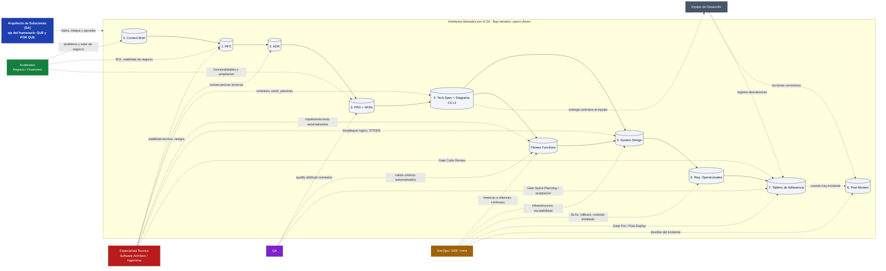

# ArquitectureFlow

Framework modular de arquitectura de soluciones asistida por IA.
Guia al **Arquitecto de Soluciones** en la creacion iterativa de artefactos
arquitectonicos con estandares de la industria.

---

## Para quien es este framework

Para **Arquitectos de Soluciones** que trabajan en el QUE y el POR QUE:
- Alineacion de negocio y seleccion tecnologica
- Estrategia de integracion y NFRs cuantificados
- Comunicacion con stakeholders via diagramas C4
- Decisiones arquitectonicas documentadas y trazables

NO es para implementacion (eso lo resuelve el Software Architect y el equipo de ingenieria).

---

## Roles que colaboran con el Arquitecto de Soluciones

El framework esta disenado para el **Arquitecto de Soluciones (SA)**, pero ningun
artefacto se construye en aislamiento. En cada fase, el SA dialoga con un rol
distinto segun la naturaleza de la decision (alineado con TOGAF 10th Ed,
seccion *Stakeholder Management* y la guia *Architecture Skills Framework*).

| Rol | Quien es | Aporta al SA |
|---|---|---|
| **Acelerador** | Experto de negocio y financiero (entiende cliente, valor, ROI) | Necesidad real, viabilidad de negocio, criterios de aceptacion funcionales |
| **Especialista Tecnico** | Software Architect / Tech Lead (experto en ingenieria) | Viabilidad tecnica, contratos, patrones, consecuencias de cada decision |
| **DevOps / SRE / Infra** | Operaciones e infraestructura | Despliegue, escalabilidad, metricas e informes para fitness functions, SLAs |
| **QA** | Calidad y verificacion | Quality Attribute Scenarios, criterios de aceptacion automatizables |
| **Equipo de Desarrollo** | Quien implementa el QUE | Recibe contratos claros, registra desviaciones, ejecuta acciones correctivas |

### Diagrama de interaccion: que rol colabora en cada artefacto



### Como leer el diagrama

- El **SA es el eje**: lidera, integra y aprueba **todos** los artefactos
  (cuadro central). Los demas roles **alimentan** el artefacto correspondiente
  con la informacion que el SA por si solo no posee.
- Las **flechas continuas** del flujo central muestran la secuencia recomendada
  de artefactos (ver `references/protocolo-iteracion.md`).
- Las **flechas punteadas** muestran la colaboracion: el rol externo aporta
  contenido o validacion al artefacto en esa fase.
- **PRD**: el SA dialoga con el **Acelerador** porque alli se traduce la
  necesidad del cliente en NFRs cuantificados; **QA** entra para definir
  *Quality Attribute Scenarios* (ISO/IEC 25010:2023).
- **Tech Spec**: el SA detalla con el **Especialista Tecnico** los contratos de
  integracion, y desde ahi el equipo de desarrollo recibe el QUE con claridad.
- **Fitness Functions**: las **define el SA** (que medir y umbrales), las
  **implementa Ingenieria**, y **DevOps reporta** las metricas que validan que
  la arquitectura sigue siendo "fit" (ver `templates/fitness-functions.md`).
- **Tablero de Adherencia**: cada gate tiene un dueno operativo distinto
  (ver `templates/tablero-adherencia.md` seccion 3).

> **Nota TOGAF:** Este modelo respeta el principio de *separation of concerns*
> entre Solution Architecture (QUE/POR QUE) y Software Architecture / Operations
> (COMO), y formaliza los puntos de colaboracion sin convertir al SA en cuello
> de botella. Ver `references/scope-sa-vs-swa.md` para la delineacion completa.

---

## Flujo de Trabajo

El framework sigue una metodologia **specs-driven iterativa**: no es necesario completar
todos los artefactos antes de entregar valor. Cada artefacto entregado es valor.

### Orden recomendado

```
  0. Context Brief           "Cual es el problema y el contexto?"
     |                       (OBLIGATORIO antes de cualquier artefacto)
     |
  1. RFC                     "Que opciones tenemos y cual recomendamos?"
     |
  2. ADR                     "Que decisiones tomamos y por que?"
     |
  3. PRD                     "Que funcionalidades exactamente?"
     |
  4. Tech Spec + Diagramas   "Con que tecnologias y como se integran?"
     |                       (Diagrama C4 Level 2 via Excalidraw MCP)
     |
  5. System Design           "Como escala, como es seguro?"
     |
  6. Req. Operacionales (*)  "Que necesita Operations para operar?"
     |
  7. Tablero Adherencia      "Como rastreamos avance y alineacion?"
     |                       (Puente entre arquitectura e implementacion)
     |
  8. Post-Mortem (**)        "Que aprendimos cuando fallo?"

  (*) El SA define REQUISITOS operacionales; Operations redacta los procedimientos
  (**) Solo cuando ocurre un incidente
```

### Regla de oro: iteracion sobre perfeccion

> Un RFC Draft entregado hoy tiene mas valor que un RFC perfecto que nunca se publica.

Los artefactos maduran de Draft a Approved conforme avanza la comunicacion con los equipos.
No esperar a tener toda la informacion para empezar a escribir.

### Si el sistema incluye un agente LLM:
Agregar **System Prompt Spec** en paralelo con la Tech Spec.

### Excepciones validas al orden:
- Decision urgente que bloquea al equipo → empezar con **ADR**
- Incidente en produccion → empezar con **Post-Mortem**
- Spike tecnico → **RFC lite** (version reducida)
- Integracion con tercero → agregar **Context Map** en paralelo

---

## Como usar este framework (guia para arquitectos)

Este framework funciona como un **asistente de IA** que te guia paso a paso.
Tu le das el contexto de negocio, y la IA genera borradores de artefactos
que tu revisas, corriges y apruebas. Tu sigues siendo el arquitecto — la IA
es tu asistente.

**El punto de entrada SIEMPRE es el orquestador (`/orquestador`).**
El orquestador detecta automaticamente si hay artefactos existentes y te pregunta
si quieres continuar o iniciar un flujo nuevo.

| Comando | Que hace |
|---|---|
| `/orquestador` | Auto-detecta: si hay artefactos muestra estado, si no inicia nuevo |
| `/orquestador nuevo` | Inicia arquitectura nueva en carpeta nueva |
| `/orquestador continuar` | Lista arquitecturas del proyecto y pregunta cual continuar |
| `/orquestador estado` | Muestra estado de artefactos sin preguntar |
| `/orquestador critica [artefacto]` | Ejecuta critica (Fase 4) sobre un artefacto |
| `/orquestador drawflow` | Abre el hub unificado de diagramación (Excalidraw + Python) |

> **Primer uso?** Ver `taller.md` para un taller paso a paso con prompts de ejemplo.

---

### Dos modos de uso: standalone o dentro de un repo existente

#### Modo 1: Standalone (clonar el framework)

Para arquitectos que quieren usar el framework como proyecto independiente:

```bash
git clone https://github.com/MAKERS-SAS-ORG/arquitectureflow.git
cd arquitectureflow
claude                  # o abrir en Claude Desktop / Cursor / VS Code
/orquestador nuevo      # inicia Fase 0
```

Los artefactos se guardan en subcarpetas dentro del repo:
```
arquitectureflow/
├── .claude/commands/   # slash commands (/orquestador)
├── skills/             # skills del framework
├── templates/          # plantillas de artefactos
├── references/         # material de referencia
└── mi-proyecto/        # TU arquitectura va aqui
    ├── CB-001.md
    ├── RFC-001.md
    └── ...
```

#### Modo 2: Dentro de un repo existente

Para equipos que quieren agregar arquitectura a un codebase existente:

```bash
cd mi-aplicacion-existente

# Opcion A: Submodulo git (recomendado — mantiene framework actualizable)
git submodule add https://github.com/MAKERS-SAS-ORG/arquitectureflow.git .arquitectura

# Opcion B: Copiar solo lo necesario
mkdir -p .claude/commands docs/arquitectura
cp arquitectureflow/.claude/commands/orquestador.md .claude/commands/
cp -r arquitectureflow/skills arquitectureflow/templates arquitectureflow/references docs/arquitectura/
```

**Con submodulo**, la estructura queda:
```
mi-aplicacion/
├── src/                    # tu codigo
├── .arquitectura/          # submodulo de arquitectureflow
│   ├── skills/
│   ├── templates/
│   └── references/
├── .claude/commands/       # COPIAR orquestador.md aqui (o symlink)
│   └── orquestador.md     # apunta a .arquitectura/skills/orquestador/SKILL.md
└── docs/arquitectura/      # tus artefactos van aqui
    ├── CB-001.md
    ├── RFC-001.md
    └── ...
```

**Importante si usas submodulo:** Copiar `.claude/commands/orquestador.md` a la raiz
del repo (Claude Code lee `.claude/commands/` de la raiz, no de submodulos).
Editar las rutas dentro del archivo para apuntar a `.arquitectura/skills/...`.

### Prerequisito: elegir tu herramienta de IA

| Herramienta | Donde se usa | Como se instala |
|---|---|---|
| **Claude Code** (recomendado) | Terminal o VS Code | `npm install -g @anthropic-ai/claude-code` |
| **GitHub Copilot** | VS Code, JetBrains | Extension de Copilot + Copilot Chat |
| **Cursor** | Editor Cursor | Ya incluido |

### Con Claude Code (recomendado)

Claude Code lee automaticamente `CLAUDE.md` y conoce todos los skills.

```bash
# 1. Clonar este repositorio
git clone https://github.com/MAKERS-SAS-ORG/arquitectureflow.git
cd arquitectureflow

# 2. Abrir Claude Code
claude

# 3. Iniciar el orquestador — SIEMPRE es el punto de entrada
```

**Que decirle a Claude:**

```
> /orquestador
  → Inicia el flujo completo. Claude te pedira el Context Brief (Fase 0),
    seleccionara artefactos (Fase 1), y te guiara por cada uno.

> "Necesito disenar la arquitectura de un nuevo sistema de inversiones"
  → Claude carga el orquestador automaticamente, empieza por el Context Brief

> /orquestador — ya tengo el CB-001 listo, quiero crear el RFC
  → Claude valida que CB-001 existe y carga el skill de RFC

> /orquestador — critica el RFC-001
  → Claude aplica la Fase 4 (critica automatica con 🔴🟡🟢)

> /orquestador — genera diagrama C4 para la Tech Spec
  → Claude abre el hub `drawflow/` y usa `excalidraw-local` para C4 interactivo, o `diagrams-python` para infraestructura as code.
```

### Con GitHub Copilot

Copilot no tiene `/orquestador` nativo, pero puedes simular el flujo
referenciando el skill del orquestador en Copilot Chat:

```
# Paso 1: Iniciar con el orquestador
@workspace Lee skills/orquestador/SKILL.md y guiame desde la Fase 0.
Necesito disenar un sistema de pagos.

# Paso 2: El orquestador te pedira el Context Brief
@workspace Lee templates/context-brief.md y ayudame a llenarlo
con el contexto que te acabo de dar.

# Paso 3: El orquestador selecciona artefactos y carga cada skill
@workspace Segun el Context Brief CB-001 y references/matriz-decision.md,
que artefactos necesito? Empieza con el primero.

# Paso 4: Para cada artefacto siguiente
@workspace Sigue con el siguiente artefacto del flujo del orquestador.
```

### Con Cursor

Cursor lee `CLAUDE.md` automaticamente:

```
1. Abrir el proyecto en Cursor
2. En el chat: "/orquestador — necesito disenar un nuevo sistema"
3. Cursor seguira el flujo del orquestador
```

---

## Flujo guiado por el orquestador

Cuando escribes `/orquestador`, la IA ejecuta estas fases en orden:

### Fase 0: Context Brief (OBLIGATORIO)
La IA te hace preguntas de contexto y genera `CB-NNN.md`:
- Problema de negocio (max 2 oraciones)
- Stakeholders y gobernanza
- Restricciones tecnicas
- Scope IN/OUT

> Sin Context Brief aprobado, no se crea ningun otro artefacto.

### Fase 1: Seleccion de artefactos
La IA consulta `references/matriz-decision.md` y te dice:
- Que artefactos son obligatorios (MUST) para tu tipo de proyecto
- Que artefactos son recomendados (SHOULD)
- En que orden crearlos

### Fases 2-3: Creacion iterativa y hand-off a skill
Para cada artefacto, la IA:
1. Carga el skill correspondiente (`skills/[nombre]/SKILL.md`)
2. Carga la plantilla (`templates/[nombre].md`)
3. Genera un borrador basado en tu Context Brief
4. Marca con 🔴 TODO lo que necesita tu validacion

> No necesitas tenerlo perfecto — un Draft con TODOs tiene mas valor que nada.

### Fase 4: Critica automatica
Despues de cada artefacto, la IA actua como arquitecto esceptico:
- Encuentra minimo 3 problemas
- Clasifica: 🔴 Critico | 🟡 Importante | 🟢 Sugerencia

### Fase 5: Diagramas C4

Cuando un artefacto necesita diagrama (Tech Spec, System Design), la IA:

1. **Selecciona herramienta** — Carga `drawflow/SKILL.md` y consulta la tabla de decisión:
   - C4 Context/Container/Component → `excalidraw-local` (canvas interactivo, 26 MCP tools)
   - Infraestructura AWS/GCP/K8s → `diagrams-python` (iconos oficiales cloud)
   - Boceto rápido → `excalidraw-remote`
   - Secuencias/flujos → Mermaid inline

2. **Si usa Excalidraw Local** — La IA sigue `skills/diagramas/SKILL.md` que define:
   - **Colores C4:** Persona `#08427b`, Container `#438dd5`, Sistema externo `#999999`, Boundary `#e8f4f8` dashed
   - **Workflow MCP:** `clear_canvas` → `batch_create_elements` (shapes + texto + arrows) → `set_viewport` → `get_canvas_screenshot` → iterar
   - **Estructura:** Cada container = rectangle + text nombre + text tecnología + text descripción
   - **Anti-patrones:** NO generar JSON raw, NO usar fontSize < 14, NO cruzar flechas
   - Tu lo revisas en http://localhost:3000

3. **Si usa Diagrams Python** — La IA crea un script `.py` basado en los templates
   de `drawflow/tools/diagrams-python/templates/` y lo ejecuta para generar PNG.

> **Referencia completa para la IA:** `skills/diagramas/SKILL.md` contiene la receta paso a paso
> con colores, tamaños, estructura de elementos C4 y el protocolo MCP completo.
> `drawflow/SKILL.md` contiene la tabla de decisión de herramientas.

| Comando | Acción |
|---|---|
| `/orquestador drawflow` | Menú interactivo de herramientas de diagramación |
| `/orquestador excalidraw-local` | Directo al canvas Excalidraw MCP local |
| `/orquestador diagrams-python` | Directo a Diagrams Python (iconos cloud) |

### Para diagramas: iniciar el canvas Excalidraw
```bash
# Solo necesario cuando vas a generar diagramas (Fase 5)
cd drawflow/tools/excalidraw-local/server && PORT=3000 npm run canvas
# Abrir http://localhost:3000 en el navegador para ver el canvas en vivo
```

### Fase 6: Consistencia entre artefactos
La IA verifica que los artefactos no se contradigan entre si
y te guia al siguiente. El ciclo se repite hasta completar el checklist.

### Fase 7: Tablero de Adherencia Arquitectonica
Cuando los artefactos criticos estan listos, la IA genera el **TAA** (`templates/tablero-adherencia.md`):
- Estado de todos los artefactos y criterio de "arquitectura suficiente"
- Mapa de trazabilidad: decision → modulo → validacion
- Gates de revision por sprint (Planning, Code Review, Pre-Deploy, Post-Deploy)
- Registro de desviaciones para cuando el equipo se desvia de la arquitectura
- Dashboard de Fitness Functions con estado de automatizacion

---

## Skills con Tessl (opcional — evaluacion y distribucion)

[Tessl](https://tessl.io) es el package manager para skills de agentes IA.
Permite instalar, versionar y evaluar skills compatibles con Claude, Copilot y Cursor.

### Skills relevantes en el registro de Tessl

| Skill | Que hace | Score |
|---|---|---|
| [c4-architecture](https://tessl.io/registry/skills/github/softaworks/agent-toolkit/c4-architecture) | Genera diagramas C4 en Mermaid con workflow de 4 pasos | Quality: 86%, Impact: 95% |
| [architecture-patterns](https://tessl.io/registry/skills/github/secondsky/claude-skills/architecture-patterns) | Clean Architecture, Hexagonal, DDD patterns | Quality: 52% (en mejora) |

### Como usar Tessl para evaluar y distribuir skills

```bash
# Instalar Tessl
curl -fsSL https://get.tessl.io | sh
tessl login

# Inicializar en tu proyecto (detecta Claude Code y Copilot automaticamente)
cd arquitectureflow
tessl init

# Buscar skills de arquitectura
tessl search architecture
tessl search "C4 model"

# Instalar un skill del registro
tessl install softaworks/agent-toolkit --skill c4-architecture

# Listar skills instalados
tessl list
```

### Evaluar nuestros skills con Tessl

Tessl permite evaluar la calidad de skills propios contra metricas objetivas:
```bash
# Evaluar un skill local
tessl skill review --optimize ./skills/rfc/SKILL.md
tessl skill review --optimize ./skills/tech-spec/SKILL.md
```

### Publicar skills al registro (futuro)
Si quieres compartir los skills de ArquitectureFlow con otros arquitectos:
```bash
tessl publish ./skills/orquestador
```

Ver registro completo en: https://tessl.io/registry

---

## Estructura del proyecto

```
arquitectureflow/
|
|-- CLAUDE.md                  # Punto de entrada para Claude (instrucciones del proyecto)
|-- README.md                  # Esta guia
|
|-- skills/                    # Skills modulares (workflow guiado)
|   |-- orquestador/           # Orquestador principal
|   |-- rfc/                   # Request for Comments
|   |-- adr/                   # Architecture Decision Record
|   |-- prd/                   # Product Requirements Document
|   |-- tech-spec/             # Technical Specification
|   |-- system-design/         # System Design Document
|   |-- runbook/               # Requisitos Operacionales (SA scope)
|   |-- post-mortem/           # Post-Mortem de Incidentes
|   |-- system-prompt-spec/    # Especificacion de Agente LLM
|   '-- diagramas/             # Generacion de diagramas C4
|
|-- templates/                 # Plantillas de artefactos
|   |-- _frontmatter.md        # Frontmatter YAML comun
|   |-- context-brief.md       # Context Brief (Fase 0 — OBLIGATORIO)
|   |-- rfc.md
|   |-- adr-madr.md            # Formato MADR 4.0
|   |-- adr-nygard.md          # Formato Nygard lightweight
|   |-- prd.md
|   |-- tech-spec.md
|   |-- system-design.md
|   |-- runbook.md
|   |-- post-mortem.md
|   |-- system-prompt-spec.md
|   |-- context-map.md         # DDD Context Map
|   |-- fitness-functions.md   # Architecture Fitness Functions
|   '-- tablero-adherencia.md  # Tablero de Adherencia Arquitectonica (TAA)
|
|-- references/                # Material de referencia
|   |-- bibliografia.md        # 20+ estandares citados
|   |-- manifiesto.md          # Anti-vibecoding
|   |-- scope-sa-vs-swa.md     # SA vs Software Architect
|   |-- niveles-madurez.md     # Draft -> Approved -> Superseded
|   |-- matriz-decision.md     # Que artefactos por tipo de proyecto
|   |-- protocolo-iteracion.md # Metodologia specs-driven
|   |-- nfr-taxonomia.md       # ISO 25010 + Quality Attribute Scenarios
|   |-- patrones-integracion.md # Patrones a nivel de politica SA
|   |-- diagramas-estrategia.md # Excalidraw vs Mermaid por artefacto
|   |-- c4-guia.md             # C4 Model para SA (L1-L2)
|   '-- mcp-excalidraw-guia.md # Guia practica del MCP server
|
|-- drawflow/                  # Hub unificado de diagramacion (3 herramientas)
|   |-- SKILL.md               # Tabla de decision: que herramienta usar
|   |-- README.md              # Comparacion y documentacion
|   '-- tools/
|       |-- excalidraw-local/  # Excalidraw MCP (26 tools, C4 iterativo)
|       |   |-- TOOL.md        # Guia de las 26 herramientas MCP
|       |   |-- libs/          # Librerias C4, software-architecture
|       |   |-- references/    # Cheatsheet de referencia
|       |   |-- scripts/       # Scripts CLI (create, delete, clear, etc.)
|       |   '-- server/        # Excalidraw MCP server (yctimlin)
|       |       |-- ext/       # Librerias C4, BPMN, hexagonal
|       |       '-- dist/      # Build compilado (index.js)
|       |-- excalidraw-remote/ # Excalidraw oficial (bocetos rapidos)
|       |   '-- TOOL.md        # Config MCP remoto
|       '-- diagrams-python/   # Diagrams mingrammer (iconos cloud)
|           |-- TOOL.md        # Guia de providers y uso
|           |-- templates/     # Templates: C4, AWS, K8s, Microservicios
|           '-- output/        # PNGs generados
|
|-- taller.md                  # Taller guiado paso a paso
|
'-- examples/                  # Ejemplos completos
    '-- inversion-pasiva/      # Plataforma de inversion en renta fija
        |-- CB-001.md          # Context Brief (Fase 0)
        |-- RFC-001.md         # Request for Comments
        |-- ADR-001.md         # Decision: event-driven con SQS
        |-- PRD-001.md         # Product Requirements + QA scenarios
        |-- TS-001.md          # Tech Spec + contratos
        |-- SD-001.md          # System Design + STRIDE
        |-- RO-001.md          # Requisitos Operacionales
        |-- CM-001.md          # Context Map DDD
        |-- FF-001.md          # Fitness Functions
        |-- TAA-001.md         # Tablero de Adherencia Arquitectonica
        '-- c4-container-diagram.excalidraw
```

---

## Artefactos: que aporta el SA en cada uno

| Artefacto | El SA define | NO define (scope de otros) |
|---|---|---|
| **Context Brief** | Problema, stakeholders, restricciones, scope IN/OUT | -- (es 100% SA) |
| **RFC** | Opciones, recomendacion, riesgos, plan de rollback | Detalles de implementacion |
| **ADR** | Decision, justificacion, consecuencias, validacion | Configuracion especifica |
| **PRD** | NFRs cuantificados, quality attribute scenarios, scope | Features detalladas (Product Owner) |
| **Tech Spec** | Stack, contratos de integracion, politicas de solucion | Patrones de codigo, estructura de clases |
| **System Design** | SLOs, STRIDE, escalabilidad, deployment logico | Infra fisica, CI/CD pipelines |
| **Fitness Functions** | Que medir, umbrales, que bloquea deploy | Implementacion de tests automatizados |
| **Req. Operacionales** | Metricas criticas, SLAs, criterios de rollback | Procedimientos paso a paso (Operations) |
| **Context Map** | Bounded contexts, patrones de integracion DDD | Implementacion de ACL, adapters |
| **Tablero Adherencia** | Estado de artefactos, trazabilidad, gates de revision, desviaciones | Procedimientos de desarrollo, CI/CD |
| **Post-Mortem** | Facilitacion, causa raiz sistemica, acciones | Fixes de codigo |
| **System Prompt Spec** | Allowlist, denylist, compliance, test cases | Fine-tuning, prompt engineering avanzado |

---


## Estandares de referencia

Todos los artefactos estan alineados con estandares documentados en `references/bibliografia.md`:

| Estandar | Aplicabilidad |
|---|---|
| **TOGAF 10th Ed** (The Open Group, 2022) | Gobernanza, ADM, Architecture Building Blocks |
| **ISO/IEC/IEEE 42010:2022** | Estructura de descripciones de arquitectura |
| **C4 Model** (Simon Brown) | Notacion de diagramas (L1 Context, L2 Container) |
| **Arc42 v8** (Starke & Hruschka) | Template de documentacion |
| **MADR 4.0** (Kopp et al., 2024) | Formato de ADR |
| **ISO/IEC 25010:2023** (SQuaRE) | Taxonomia de atributos de calidad |
| **Building Evolutionary Architectures** (Ford, Parsons, Kua, 2023) | Fitness functions, arquitectura incremental |
| **Domain-Driven Design** (Evans, Vernon, Khononov) | Bounded contexts, context mapping |
| **Google SRE Book** (Beyer et al., 2016) | Post-mortem blameless, SLIs/SLOs |
| **STRIDE** (Microsoft) | Modelo de amenazas de seguridad |
| **Team Topologies** (Skelton, Pais, 2019) | Alineacion equipo-arquitectura |

---
# Glosario de Arquitectura de Software
0. Context Brief (Resumen de Contexto)
No es una sigla en sí, sino un documento de alineación inicial.
* Significado: Es el "porqué" del proyecto. Antes de tirar una sola línea de código o diseñar una base de datos, el equipo debe entender el valor de negocio y el problema real que intenta resolver el usuario.
1. RFC — Request for Comments
* Traducción: Solicitud de Comentarios.
* Propósito: Es un documento colaborativo donde se propone una solución o cambio importante. Su objetivo es recibir feedback de otros ingenieros antes de que la idea esté "grabada en piedra". Ayuda a identificar puntos ciegos y fomenta el consenso técnico.
2. ADR — Architecture Decision Record
* Traducción: Registro de Decisión de Arquitectura.
* Propósito: Un documento corto que captura una decisión técnica específica, su contexto y sus consecuencias.¿Por qué es vital? Para que en dos años, cuando alguien pregunte "¿Por qué usamos una base de datos de grafos aquí?", haya un registro histórico que explique el razonamiento detrás de esa elección.
3. PRD — Product Requirements Document
* Traducción: Documento de Requerimientos del Producto.
* Propósito: Define qué se va a construir. Generalmente lo escribe el Product Manager (PM) y detalla las funcionalidades, los criterios de aceptación y los flujos de usuario. Es la guía para que el equipo técnico sepa qué problemas debe solucionar el sistema.
4. Tech Spec — Technical Specification
* Traducción: Especificación Técnica.
* Propósito: Define cómo se va a construir lo que pide el PRD. Aquí entran los detalles de bajo nivel:
    * Esquemas de base de datos.
    * Contratos de API (endpoints, payloads).
    * Diagramas de secuencia y Diagramas C4 (Contexto, Contenedores, Componentes, Código).
5. System Design
* Traducción: Diseño de Sistema.
* Propósito: La visión macro de la infraestructura. Se enfoca en los atributos de calidad (los famosos -ilities):
    * Escalabilidad: ¿Cómo aguanta el sistema 1 millón de usuarios?
    * Disponibilidad: ¿Qué pasa si falla un servidor?
    * Seguridad: ¿Cómo protegemos los datos en tránsito y en reposo?
## Principio Anti-Vibecoding

> Si no puedes explicar en un parrafo que problema resuelve lo que estas
> a punto de construir, no estas listo para construir.

Este framework existe para: **Pensar antes de construir. Documentar antes de codear. Decidir antes de implementar.**

Ver `references/manifiesto.md` para el manifiesto completo.
