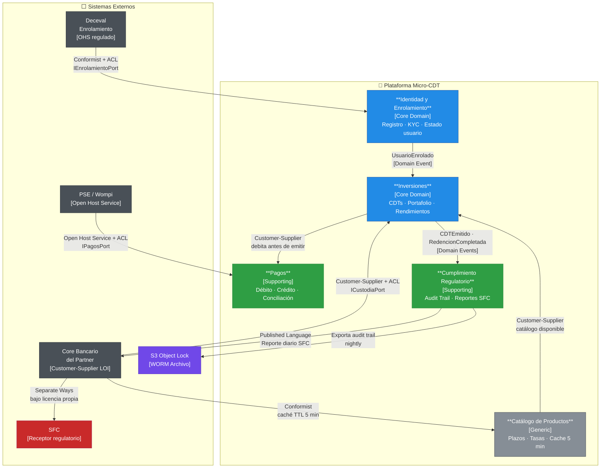

# CM-001: Context Map — Plataforma de Micro-Inversión en CDTs

> Referencia: Evans, E. *Domain-Driven Design.* 2003. Capítulo 14.
> Referencia: Vernon, V. *Implementing Domain-Driven Design.* 2013.

---

## Bounded Contexts Identificados

| Bounded Context | Subdominio | Tipo | Responsabilidad |
|---|---|---|---|
| **Identidad y Enrolamiento** | Onboarding | Core | Ciclo de vida del usuario: registro, OTP, KYC vía Deceval, estado de enrolamiento. Produce `deceval_user_id` como referencia canónica del usuario en el mercado de valores |
| **Inversiones** | Gestión de CDTs | Core | Ciclo de vida del CDT: emisión, portafolio, cálculo de rendimientos, vencimiento, redención. Es el corazón del modelo de negocio |
| **Pagos** | Movimiento de fondos | Supporting | Débito PSE al comprar, crédito PSE al redimir. Abstrae la mecánica de movimiento de dinero del dominio de inversiones |
| **Cumplimiento Regulatorio** | Audit y reportes | Supporting | Audit trail inmutable (ADR-003), exportación S3 nocturna, generación y entrega del reporte diario SFC al Core Bancario. No define negocio — garantiza trazabilidad |
| **Catálogo de Productos** | Oferta de CDTs | Generic | Ingesta y caché del catálogo de CDTs (plazos, tasas, emisores) proveniente del Core Bancario. TTL 5 min. Sin lógica de negocio propia |

### Contextos Externos (fuera del sistema — sin ownership)

| Contexto Externo | Tipo | Patrón de relación |
|---|---|---|
| **Deceval — Enrolamiento** | Sistema regulado externo | Conformist + ACL desde Identidad |
| **Core Bancario del Partner** | Sistema externo (LOI) | Customer-Supplier (upstream) + ACL desde Inversiones y Reportes |
| **PSE / Wompi** | Sistema externo comercial | Open Host Service + ACL desde Pagos |
| **SFC** | Ente regulatorio (receptor) | Sin integración directa — receptor de reportes vía Core Bancario |

---

## Relaciones entre Bounded Contexts

| Upstream (provee) | Downstream (consume) | Patrón | Descripción |
|---|---|---|---|
| **Deceval Enrolamiento** | **Identidad y Enrolamiento** | Conformist + ACL | Identidad implementa un ACL (`IEnrolamientoPort`) que traduce el modelo de Deceval (respuesta con `deceval_user_id`) al modelo de dominio de la plataforma. La plataforma se conforma: no puede negociar el modelo de Deceval |
| **Core Bancario del Partner** | **Inversiones** | Customer-Supplier + ACL | `ICustodiaPort` es el ACL que protege el dominio de Inversiones del modelo del Core Bancario. La plataforma negoció (LOI) el contrato de la API — es Customer-Supplier, no Conformist puro. Cambiar de partner solo requiere un nuevo adapter |
| **Core Bancario del Partner** | **Catálogo de Productos** | Conformist | El catálogo (plazos, tasas, emisores) viene en el formato del Core Bancario. Catálogo simplemente ingesta y cachea — sin traducción de modelo |
| **PSE / Wompi** | **Pagos** | Open Host Service + ACL | Wompi tiene una API bien definida (OHS). `IPagosPort` es el ACL desde Pagos — protege al dominio de Inversiones de cualquier cambio en Wompi o de una eventual migración a PSE directo (ADR-002) |
| **Inversiones** | **Pagos** | Customer-Supplier | Inversiones instruye a Pagos: "debita X antes de emitir el CDT". Pagos confirma el resultado. Inversiones es el customer que define cuándo se necesita el pago |
| **Inversiones** | **Cumplimiento Regulatorio** | Customer-Supplier (evento) | Cumplimiento consume los eventos de dominio de Inversiones (`CDTEmitido`, `RedencionCompletada`) para construir el audit trail. Inversiones no sabe que Cumplimiento existe — publica eventos, Cumplimiento los observa |
| **Identidad y Enrolamiento** | **Inversiones** | Customer-Supplier (evento) | Inversiones solo puede emitir CDTs para usuarios con `estado_enrolamiento = ENROLADO`. El evento `UsuarioEnrolado` (de Identidad) habilita operaciones en Inversiones |
| **Cumplimiento Regulatorio** | **Core Bancario del Partner** | Customer-Supplier | Cumplimiento entrega los datos del reporte diario al Core Bancario (que los transmite a SFC). El Core Bancario define el formato de entrega — Cumplimiento se adapta |

---

### Patrones de Relación Aplicados

| Patrón DDD | Dónde se aplica | Por qué |
|---|---|---|
| **Anti-Corruption Layer (ACL)** | Deceval → Identidad (`IEnrolamientoPort`); Core Bancario → Inversiones (`ICustodiaPort`); Wompi → Pagos (`IPagosPort`) | Los modelos externos (Deceval, Core Bancario, Wompi) no deben contaminar el modelo de dominio interno. El ACL traduce en la frontera |
| **Conformist** | Core Bancario → Catálogo de Productos | El catálogo viene en el formato del banco — no hay negociación posible, no vale la pena un ACL para datos de solo lectura con TTL corto |
| **Customer-Supplier** | Inversiones ↔ Pagos; Core Bancario → Inversiones (LOI negociado) | Existe un contrato negociado (LOI para el partner; contrato para Wompi) — el downstream tiene influencia sobre el upstream |
| **Open Host Service** | PSE / Wompi | Wompi publica una API pública y estable para que múltiples clientes se integren |
| **Published Language** | Reportes SFC (formato acordado con Core Bancario) | Formato de intercambio definido conjuntamente con el partner para los reportes regulatorios |
| **Separate Ways** | SFC (ente regulatorio) | La plataforma no integra con la SFC directamente. El Core Bancario gestiona esa relación bajo su propia licencia |

---

## Diagrama del Context Map



---

## Domain Events entre Contextos

| Evento | Productor | Consumidor | Payload principal | Trigger |
|---|---|---|---|---|
| `UsuarioEnrolado` | Identidad y Enrolamiento | Inversiones | `{ deceval_user_id, usuario_id, timestamp }` | Deceval retorna estado `ENROLADO` |
| `DebitoConfirmado` | Pagos | Inversiones | `{ referencia_pse, monto_cop, usuario_id, timestamp }` | Wompi notifica débito exitoso |
| `DebitoFallido` | Pagos | Inversiones | `{ referencia_pse, motivo, usuario_id }` | Wompi notifica rechazo |
| `CDTEmitido` | Inversiones | Cumplimiento Regulatorio | `{ id_cdt_deceval, usuario_id, monto, tasa, fecha_vencimiento, referencia_pse }` | Core Bancario confirma registro en Deceval |
| `EmisionFallida` | Inversiones | Pagos + Cumplimiento | `{ referencia_pse, motivo, usuario_id }` | Core Bancario retorna error tras débito exitoso |
| `CDTPendienteRedencion` | Inversiones | Pagos + Cumplimiento | `{ id_cdt_deceval, usuario_id, monto_principal, rendimiento }` | Worker de Eventos detecta vencimiento (22:00 COT) |
| `RedencionCompletada` | Inversiones | Cumplimiento Regulatorio | `{ id_cdt_deceval, usuario_id, monto_total, referencia_credito_pse }` | PSE confirma crédito exitoso al usuario |
| `AuditTrailExportado` | Cumplimiento Regulatorio | — (S3 Object Lock) | `{ fecha, ruta_s3, hash_merkle, total_eventos }` | Worker de Eventos trigger-2 (02:00 COT) |
| `ReporteSFCEntregado` | Cumplimiento Regulatorio | Core Bancario del Partner | `{ fecha, total_emisiones, total_redencioness, hash_integridad }` | Worker de Eventos trigger-3 (23:00 COT) |

---

## Notas de Diseño para el Tech Lead

### ACL: la regla de oro
Ningún tipo del modelo de Deceval, Wompi o el Core Bancario debe cruzar la frontera del ACL hacia el interior del dominio. Los ports (`IEnrolamientoPort`, `ICustodiaPort`, `IPagosPort`) solo deben hablar el lenguaje del dominio propio:

```
// CORRECTO: el dominio habla su propio lenguaje
EnrolamientoResult IEnrolamientoPort.IniciarEnrolamiento(UsuarioId userId);

// INCORRECTO: el modelo de Deceval contamina el dominio
DecevalEnrolamientoResponse IEnrolamientoPort.IniciarEnrolamiento(DecevalRequest req);
```

### Inversiones no sabe de Pagos directamente
Inversiones publica el evento `CDTSolicitado` con el monto — Pagos reacciona e inicia el débito. Inversiones no llama a Pagos directamente. Este desacoplamiento garantiza que un fallo en Pagos no hace fallar el modelo de Inversiones.

### `deceval_user_id` es la llave cruzada entre contextos
Es el único identificador que cruza la frontera de Identidad hacia Inversiones y Cumplimiento. Nunca se pasan datos de identidad (documento, biometría) fuera del contexto de Identidad.

---

## Crítica Automática (Fase 4)

### 🟡 Importantes

**🟡 I-01: El contexto de Catálogo de Productos podría no justificar un bounded context propio.**
Con solo una responsabilidad (cachear el catálogo del partner con TTL 5 min), Catálogo es tan delgado que podría vivir como un servicio de aplicación dentro de Inversiones en lugar de un contexto separado. La separación es válida conceptualmente (distintas fuentes de cambio: el catálogo cambia cuando el partner cambia sus productos; Inversiones cambia cuando cambia el dominio de negocio), pero el equipo debe decidir conscientemente si merece un repositorio/módulo separado o si es un servicio interno de Inversiones.

**🟡 I-02: El event model entre Inversiones y Pagos es síncrono en la implementación actual.**
El Context Map modela Inversiones instruyendo a Pagos como Customer-Supplier con un evento `DebitoConfirmado`. Sin embargo, en la TS-001 el débito PSE es síncrono (Wompi redirige al usuario). El event model es una aspiración de desacoplamiento — la implementación actual es más tight coupling. El Tech Lead debe ser consciente de que el diagrama idealiza la separación.

### 🟢 Sugerencias

**🟢 S-01:** Considerar nombrar los bounded contexts en inglés en el código (Enrollment, Investments, Payments, Compliance, Catalog) pero en español en los documentos de arquitectura. Esto evita confusión cuando el código se genere — los namespaces del código deben coincidir con los bounded contexts del CM.
