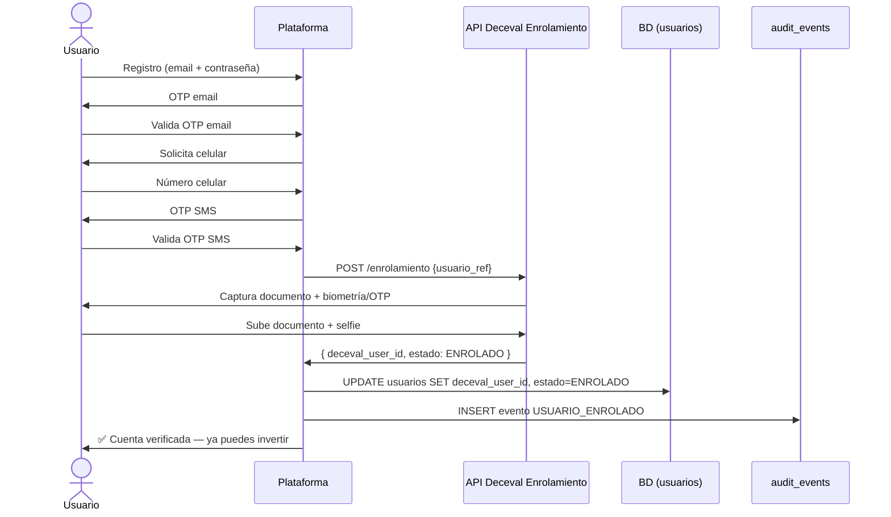
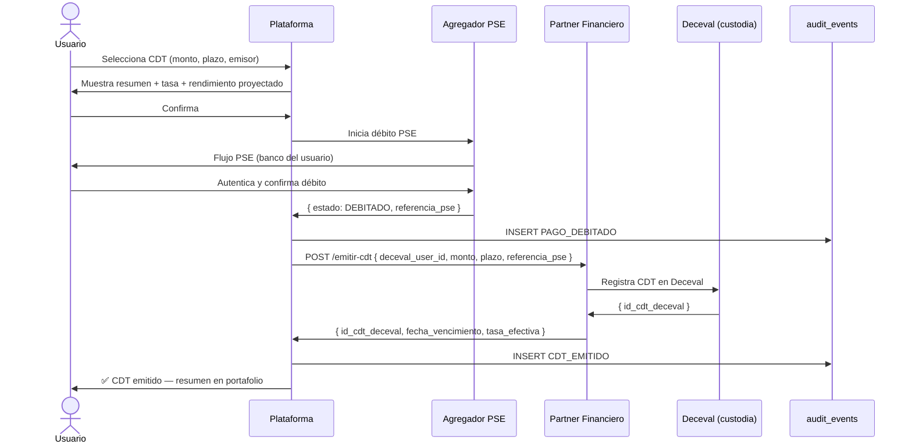

# PRD-001: Plataforma de Micro-Inversión en CDTs — MVP

---

## 1. Objetivo del Producto

Permitir que cualquier colombiano con capacidad de ahorro invierta en CDTs desde $100,000 COP
en menos de 8 minutos, completamente en línea, con rendimientos reales positivos y sin
requerir montos mínimos bancarios ni presencia física.

---

## 2. Usuarios Objetivo

| Persona | Descripción | Necesidad Principal |
|---|---|---|
| **Ahorrador digital** | Colombiano 25–45 años, ingresos medios, smartphone, actualmente ahorra en cuentas de bajo rendimiento | Poner su dinero a trabajar con tasas reales sin procesos complejos ni montos inalcanzables |
| **Operador de Compliance** | Miembro del equipo de Compliance interno | Acceso a audit trail y reportes para la SFC sin fricción operativa |
| **Sistema (proceso batch)** | Lambda nocturna de redención automática | Procesar vencimientos de CDTs sin intervención humana, con cero errores de conciliación |

---

## 3. Funcionalidades — Casos de Uso

### CU-001: Onboarding con KYC (Registro + Verificación de Identidad)

- **Actores:** Usuario no registrado, API de Enrolamiento Deceval (ADR-004)
- **Prioridad:** Must Have — sin esto, ningún otro caso de uso es posible
- **Precondición:** El usuario tiene email, número de celular colombiano y documento de identidad válido (CC o CE).

**Flujo Principal:**
1. El usuario ingresa email y contraseña en la plataforma.
2. El sistema envía OTP de verificación al email.
3. El usuario valida el OTP de email.
4. El sistema solicita número de celular y envía OTP SMS.
5. El usuario valida el OTP SMS.
6. La plataforma llama a la API de Enrolamiento Deceval con los datos mínimos del usuario.
7. Deceval orquesta la captura del documento de identidad (foto frontal + trasera) y la verificación biométrica (selfie con liveness) o confirmación OTP alternativa.
8. Deceval retorna `{ deceval_user_id, estado: "ENROLADO" }`.
9. La plataforma persiste `deceval_user_id` + estado en la tabla `usuarios`. **No almacena documento ni biometría.**
10. El usuario recibe confirmación y queda habilitado para invertir.

**Flujos Alternativos:**
- **Alt-A — Biometría rechazada por Deceval (1 reintento):** El sistema muestra instrucciones de captura mejoradas y permite un segundo intento. Si falla de nuevo, el estado queda `EN_REVISION` y Compliance es notificado.
- **Alt-B — OTP SMS no recibido:** El usuario puede solicitar reenvío hasta 3 veces con backoff de 60s. Si persiste, opción de llamada de voz.
- **Alt-C — Documento rechazado por Deceval:** El sistema muestra el motivo específico retornado por Deceval (documento vencido, imagen ilegible, etc.) y permite reintentar con nueva captura.
- **Alt-D — Timeout de la API Deceval (> 30s):** El sistema guarda el estado `EN_PROCESO` y notifica al usuario por email cuando el enrolamiento complete. El usuario no queda bloqueado — puede reingresar a la app y retomar.

**Postcondición:** El usuario tiene `estado_enrolamiento = ENROLADO` y un `deceval_user_id` válido. Puede acceder a CU-002.



---

### CU-002: Compra de CDT

- **Actores:** Usuario enrolado, PSE (vía agregador, ADR-002), Partner Financiero → Deceval (ADR-001)
- **Prioridad:** Must Have — es el flujo de valor principal
- **Precondición:** `estado_enrolamiento = ENROLADO`. El usuario está autenticado.

**Flujo Principal:**
1. El usuario selecciona "Invertir".
2. La plataforma muestra el catálogo de CDTs disponibles del partner (plazo en días/meses, tasa E.A., emisor).
3. El usuario ingresa el monto (≥ $100,000 COP) y selecciona plazo + emisor.
4. La plataforma calcula y muestra: monto invertido, tasa E.A., rendimiento proyectado al vencimiento, fecha de vencimiento, y comisiones si aplican. El usuario confirma.
5. La plataforma inicia el débito PSE: redirige al usuario al flujo PSE del agregador.
6. El usuario autentica con su banco y confirma el débito.
7. El agregador PSE notifica a la plataforma: `{ estado: DEBITADO, referencia_pse }`.
8. La plataforma registra el evento `PAGO_DEBITADO` en `audit_events` **antes** de instruccionar al partner.
9. La plataforma envía instrucción de emisión de CDT al partner financiero: `{ deceval_user_id, monto, plazo, emisor, referencia_pse }`.
10. El partner registra el CDT en Deceval y retorna: `{ id_cdt_deceval, fecha_vencimiento, tasa_efectiva }`.
11. La plataforma registra `CDT_EMITIDO` en `audit_events` y actualiza el portafolio del usuario.
12. El usuario recibe confirmación con el resumen de la inversión (email + pantalla).

**Flujos Alternativos:**
- **Alt-A — Débito PSE fallido:** El sistema notifica el error PSE al usuario con el código descriptivo (fondos insuficientes, banco no disponible, cancelado por usuario). La inversión no se procesa. No hay instrucción al partner.
- **Alt-B — Partner retorna error en emisión Deceval (después del débito):** El sistema marca el CDT como `EMISION_FALLIDA`, registra el evento en `audit_events`, inicia proceso de **devolución** al usuario vía crédito PSE y notifica a Ops Financieras. SLA de devolución: < 24 horas hábiles.
- **Alt-C — Tasa del CDT cambió entre la vista y la confirmación:** Si la tasa del catálogo cambió en los últimos 60 segundos, la plataforma muestra un alert con la nueva tasa y requiere re-confirmación explícita del usuario antes de proceder.
- **Alt-D — Timeout del partner (> 30s):** El sistema pone la emisión en estado `PENDIENTE_CONFIRMACION` y reintenta con backoff exponencial (3 intentos). Si persiste, escala a Ops Financieras. El débito PSE está registrado — el usuario es notificado que su inversión está siendo procesada.

**Postcondición:** El CDT existe en el portafolio del usuario con `estado = ACTIVO`, tiene `id_cdt_deceval` válido, y existe un evento `CDT_EMITIDO` en el audit trail.



---

### CU-003: Consulta de Portafolio

- **Actores:** Usuario autenticado con CDTs activos
- **Prioridad:** Must Have — retención de usuarios depende de ver el valor de su inversión
- **Precondición:** Usuario autenticado, con al menos 1 CDT en estado `ACTIVO` o `VENCIDO`.

**Flujo Principal:**
1. El usuario accede a "Mi portafolio".
2. La plataforma carga desde la base de datos local (source of truth): lista de CDTs del usuario, con `monto_invertido`, `tasa_ea`, `fecha_inicio`, `fecha_vencimiento`, `dias_restantes`, `rendimiento_acumulado_hoy`, `estado`.
3. La plataforma calcula `rendimiento_acumulado_hoy` = `monto_invertido × ((1 + tasa_ea)^(dias_transcurridos/365) - 1)`. El cálculo es local — **no requiere llamada al partner ni a Deceval**.
4. La plataforma muestra el resumen total: `total_invertido`, `rendimiento_total_acumulado`, `proyeccion_al_vencimiento`.
5. El usuario puede ver el detalle de cada CDT individual.

**Flujos Alternativos:**
- **Alt-A — Sin CDTs activos:** La plataforma muestra estado vacío con CTA a "Invertir ahora".
- **Alt-B — CDT en estado `PENDIENTE_CONFIRMACION`:** Se muestra con indicador visual de "procesando" y timestamp del inicio. No se calcula rendimiento hasta que el estado sea `ACTIVO`.

**Postcondición:** El usuario ve el estado actualizado de su portafolio. No se generan eventos en `audit_events` (lectura pura).

**Nota de arquitectura:** Las consultas de portafolio son el caso de uso de mayor volumen (20,000/día proyectadas a 1 año). DEBEN resolverse desde la base de datos de la plataforma sin llamadas a sistemas externos — el NFR de < 500ms p99 aplica especialmente aquí.

---

### CU-004: Redención Automática al Vencimiento

- **Actores:** Sistema (proceso batch Lambda), Partner Financiero, Agregador PSE
- **Prioridad:** Must Have — es una obligación contractual con el usuario y regulatoria
- **Precondición:** Existen CDTs con `fecha_vencimiento = hoy` y `estado = ACTIVO`.

**Flujo Principal:**
1. Lambda de redención ejecuta diariamente a las 22:00 COT (fuera del horario pico).
2. La Lambda consulta CDTs con `fecha_vencimiento ≤ hoy` y `estado = ACTIVO`.
3. Para cada CDT: registra evento `REDENCION_INICIADA` en `audit_events`.
4. La Lambda instruye al partner financiero la redención: `{ id_cdt_deceval, cuenta_destino_pse }`.
5. El partner instruye la redención en Deceval y libera los fondos.
6. El partner confirma a la plataforma: `{ monto_principal, rendimiento_final, referencia_acreditacion }`.
7. El agregador PSE procesa el crédito al usuario (débito desde la cuenta de fondeo del partner).
8. La plataforma registra `REDENCION_COMPLETADA` en `audit_events`, actualiza el estado del CDT a `VENCIDO`, y envía notificación al usuario (email + push si aplica): "Tu CDT venció. Acreditamos $X a tu cuenta".
9. El reporte SFC del día incluye todas las redenciones procesadas.

**Flujos Alternativos:**
- **Alt-A — Fallo en el crédito PSE:** El estado queda `REDENCION_PENDIENTE_ACREDITACION`. Ops Financieras es notificada. El usuario recibe comunicación de demora. Reintento automático en < 4 horas.
- **Alt-B — Partner no confirma la redención en Deceval (timeout):** El estado queda `REDENCION_EN_PROCESO`. Ops Financieras tiene SLA de 2 horas hábiles para resolver manualmente.
- **Alt-C — CDT vence en día no hábil (sábado/domingo):** La Lambda ejecuta de todas formas — si el partner no puede procesar, el CDT queda en `REDENCION_PENDIENTE` hasta el siguiente día hábil. Los T&Cs del usuario informan este comportamiento.

**Postcondición:** El CDT tiene `estado = VENCIDO`, el usuario tiene los fondos acreditados en su cuenta bancaria, y existen eventos `REDENCION_INICIADA` y `REDENCION_COMPLETADA` en el audit trail.

---

### CU-005: Autenticación Recurrente, 2FA, Sesiones y Recuperación

- **Actores:** Usuario registrado (enrolado o no), Sistema de autenticación
- **Prioridad:** Must Have — prerequisito de seguridad para CU-002, CU-003 y CU-004
- **Precondición:** El usuario completó el registro en CU-001 (tiene email + contraseña + celular verificado).

**Flujo Principal — Login con 2FA:**
1. El usuario ingresa email y contraseña.
2. El sistema valida credenciales. Si son válidas, envía OTP SMS al celular registrado.
3. El usuario ingresa el OTP SMS (vigencia: 5 minutos).
4. El sistema emite un `access_token` JWT (expiración: 15 minutos) y un `refresh_token` (expiración: 7 días, rotativo).
5. El cliente almacena los tokens de forma segura (httpOnly cookie — nunca localStorage).
6. El `access_token` se renueva automáticamente usando el `refresh_token` antes de expirar.

**Flujo Principal — Renovación de Sesión:**
1. El cliente detecta que el `access_token` expira en < 2 minutos.
2. El cliente llama a `POST /auth/refresh` con el `refresh_token`.
3. El sistema valida el `refresh_token`, lo invalida y emite un nuevo par `(access_token, refresh_token)` (rotación de refresh token).
4. Si el `refresh_token` también expiró (> 7 días sin actividad), el usuario debe hacer login completo con 2FA.

**Flujo Principal — Recuperación de Contraseña:**
1. El usuario selecciona "Olvidé mi contraseña" e ingresa su email.
2. El sistema envía un enlace de reset con token de un solo uso (vigencia: 30 minutos) si el email existe. **La respuesta NO indica si el email existe o no** (evita user enumeration).
3. El usuario hace clic en el enlace, ingresa nueva contraseña y la confirma.
4. El sistema invalida todos los `refresh_token` activos del usuario (cierre de todas las sesiones).
5. El usuario debe hacer login completo con 2FA.

**Flujos Alternativos:**
- **Alt-A — Credenciales incorrectas:** Después de 5 intentos fallidos en 15 minutos, la cuenta se bloquea temporalmente por 30 minutos. El usuario recibe email de alerta.
- **Alt-B — OTP 2FA expirado o incorrecto:** El usuario puede solicitar reenvío hasta 3 veces. Si falla, debe reiniciar el login.
- **Alt-C — Celular ya no disponible:** El usuario contacta a Soporte para el proceso de recuperación de celular (fuera del flujo digital — Compliance interviene).
- **Alt-D — Sesión inactiva detectada por IP inusual:** El sistema puede requerir re-autenticación con 2FA (política configurable por Compliance).

**Postcondición:** El usuario tiene un `access_token` válido que autoriza las llamadas a CU-002, CU-003 y CU-004. El evento `LOGIN_EXITOSO` o `LOGIN_FALLIDO` queda registrado en `audit_events`.

---

## 4. User Stories con Criterios de Aceptación

### US-001: Registro y verificación de identidad

**Como** colombiano con capacidad de ahorro, **quiero** registrarme y verificar mi identidad completamente en línea, **para** poder invertir en CDTs sin ir a una sucursal bancaria.

```gherkin
Scenario: Enrolamiento exitoso con biometría
  Given el usuario ingresa email, contraseña y número de celular válidos
  And el OTP de email y SMS son validados correctamente
  When el usuario completa la captura de documento + selfie en el flujo Deceval
  Then el estado del usuario es ENROLADO en menos de 8 minutos desde el inicio
  And el usuario puede acceder al flujo de compra de CDT

Scenario: Fallo de biometría con reintento
  Given el usuario está en el paso de verificación biométrica Deceval
  When la captura del selfie es rechazada por baja calidad
  Then el sistema muestra instrucciones específicas de mejora (luz, posición)
  And permite un segundo intento sin reiniciar el flujo completo

Scenario: Timeout de API Deceval
  Given el usuario completó la captura de documento y biometría
  When la API de Deceval no responde en 30 segundos
  Then el sistema guarda el estado EN_PROCESO y muestra mensaje de "verificando identidad"
  And notifica al usuario por email cuando el enrolamiento complete
  And el usuario puede cerrar la app y retomar sin perder el progreso
```

---

### US-002: Compra de CDT

**Como** usuario enrolado, **quiero** comprar un CDT desde $100,000 COP eligiendo plazo y emisor, **para** obtener un rendimiento superior a mi cuenta de ahorros sin complicaciones.

```gherkin
Scenario: Compra exitosa de CDT
  Given el usuario está enrolado y autenticado
  And selecciona un CDT de $500,000 COP a 180 días al 12% E.A.
  When confirma el débito PSE en su banco
  Then el CDT aparece en su portafolio con estado ACTIVO en menos de 3 minutos
  And recibe email de confirmación con: monto, tasa, fecha de vencimiento, rendimiento proyectado

Scenario: Débito PSE fallido por fondos insuficientes
  Given el usuario seleccionó un CDT de $1,000,000 COP
  When el banco rechaza el débito por fondos insuficientes
  Then el sistema muestra mensaje claro del motivo del rechazo
  And no se crea ningún CDT en el portafolio
  And el usuario puede intentar con un monto menor sin reiniciar el flujo

Scenario: Cambio de tasa entre vista y confirmación
  Given el usuario vio una tasa del 12.5% E.A. en el catálogo
  When la tasa del partner cambió a 12.0% E.A. en los últimos 60 segundos
  Then el sistema interrumpe el flujo y muestra la nueva tasa destacada
  And requiere una confirmación explícita del usuario con la nueva tasa antes de continuar

Scenario: Fallo de emisión Deceval después del débito
  Given el débito PSE fue exitoso por $500,000 COP
  When el partner retorna error en el registro del CDT en Deceval
  Then el sistema NO confirma el CDT al usuario
  And inicia proceso de devolución PSE en menos de 24 horas hábiles
  And notifica a Ops Financieras con todos los detalles del incidente
  And registra todos los eventos en audit_trail para trazabilidad completa
```

---

### US-003: Consulta de portafolio

**Como** usuario con CDTs activos, **quiero** ver el rendimiento acumulado de mis inversiones en tiempo real, **para** saber cuánto dinero estoy ganando sin tener que llamar a nadie.

```gherkin
Scenario: Visualización del portafolio con CDTs activos
  Given el usuario tiene 2 CDTs activos
  When accede a "Mi portafolio"
  Then ve cada CDT con: monto invertido, tasa, días restantes, rendimiento acumulado hoy
  And ve el total consolidado: total invertido + rendimiento total acumulado
  And la pantalla carga en menos de 500ms

Scenario: Portafolio sin inversiones
  Given el usuario está enrolado pero no ha comprado ningún CDT
  When accede a "Mi portafolio"
  Then ve un estado vacío con el mensaje "Aún no tienes inversiones"
  And un botón prominente de "Invertir ahora" que lleva al catálogo de CDTs
```

---

### US-004: Redención automática al vencimiento

**Como** usuario inversor, **quiero** que mi CDT se redima automáticamente al vencimiento y los fondos se acrediten en mi cuenta, **para** no tener que recordar fechas ni hacer gestiones manuales.

```gherkin
Scenario: Redención automática exitosa
  Given un CDT del usuario vence hoy
  When el proceso batch ejecuta a las 22:00 COT
  Then el usuario recibe notificación por email antes de las 23:00 COT
  And el mensaje incluye: monto principal + rendimiento final + referencia de acreditación
  And el CDT aparece en el portafolio con estado VENCIDO
  And los fondos están disponibles en la cuenta bancaria del usuario en T+1 hábil

Scenario: Fallo en acreditación PSE — reintento automático
  Given el proceso de redención inició para un CDT vencido
  When el crédito PSE falla en el primer intento
  Then el sistema reintenta automáticamente en menos de 4 horas
  And el usuario recibe notificación de demora con fecha estimada de acreditación
  And Ops Financieras recibe alerta con todos los detalles del caso
```

---

## 5. Quality Attribute Scenarios (NFRs)

> Referencia: ISO/IEC 25010:2023, Bass et al. Quality Attribute Scenarios

### QA-001: Latencia de Operaciones — Consultas y Lecturas

| Campo | Valor |
|---|---|
| **Fuente** | Usuario autenticado |
| **Estímulo** | Solicita la pantalla de portafolio (CU-003) bajo carga normal |
| **Artefacto** | API de portafolio + base de datos RDS |
| **Entorno** | Operación normal, hasta 500 usuarios concurrentes |
| **Respuesta** | El sistema retorna el portafolio completo con rendimientos calculados |
| **Medida** | p99 < 500ms medido en el servidor. p50 < 150ms. Sin llamadas a sistemas externos en el camino crítico |

### QA-002: Latencia de Operaciones — Flujos de Escritura (Compra)

| Campo | Valor |
|---|---|
| **Fuente** | Usuario confirmando compra de CDT |
| **Estímulo** | Confirmación de inversión después del débito PSE exitoso |
| **Artefacto** | Flujo de emisión (plataforma → partner → Deceval) |
| **Entorno** | Horario bancario hábil (6am–8pm COT), carga normal |
| **Respuesta** | El CDT aparece confirmado en el portafolio del usuario |
| **Medida** | End-to-end < 3 minutos desde la confirmación del débito PSE. Si supera 30s en el paso partner→Deceval, el usuario ve estado "procesando" — no pantalla en blanco |

### QA-003: Disponibilidad del Sistema

| Campo | Valor |
|---|---|
| **Fuente** | Sistema de monitoreo (CloudWatch) |
| **Estímulo** | Fallo de una instancia de la API backend |
| **Artefacto** | API backend (AWS ECS/Lambda + RDS Aurora) |
| **Entorno** | Operación normal y durante ventana de mantenimiento |
| **Respuesta** | El sistema detecta el fallo y redirige tráfico a instancias saludables |
| **Medida** | Disponibilidad mensual ≥ 99.5% (máximo 3.6 horas de downtime/mes). RTO < 15 minutos. RPO < 5 minutos (Aurora Multi-AZ) |

### QA-004: Seguridad — Acceso No Autorizado

| Campo | Valor |
|---|---|
| **Fuente** | Actor externo (atacante) o usuario interno sin permisos |
| **Estímulo** | Intento de acceder al portafolio o datos de otro usuario; intento de modificar `audit_events` |
| **Artefacto** | API de autenticación/autorización, tabla `audit_events`, datos de usuarios |
| **Entorno** | Cualquier condición — online y offline |
| **Respuesta** | El sistema rechaza la solicitud, registra el intento en el audit log, y no expone datos |
| **Medida** | 0 accesos no autorizados exitosos en producción. Todos los endpoints de API validados con JWT. La tabla `audit_events` no tiene permisos UPDATE/DELETE para ningún rol de aplicación (enforced por IAM). Pen test superado antes del go-live |

### QA-005: Integridad del Audit Trail

| Campo | Valor |
|---|---|
| **Fuente** | SFC (auditor regulatorio) o evento de incidente interno |
| **Estímulo** | Solicitud de verificación de que los registros de operaciones no han sido alterados |
| **Artefacto** | Tabla `audit_events` + bucket S3 Object Lock |
| **Entorno** | Post-incidente o auditoría planificada — cualquier momento de los últimos 10 años |
| **Respuesta** | El sistema puede recalcular el hash encadenado de cualquier rango de eventos y compararlo con el hash raíz almacenado en S3 Object Lock, demostrando inmutabilidad |
| **Medida** | Verificación de integridad ejecutable en < 1 hora para cualquier rango de 30 días. 0 gaps en el archivo S3 (exportación nocturna con 100% de éxito). Retención garantizada 10 años por S3 Object Lock COMPLIANCE |

### QA-006: Tolerancia a Fallos de Sistemas Externos

| Campo | Valor |
|---|---|
| **Fuente** | Fallo de disponibilidad del partner financiero o del agregador PSE |
| **Estímulo** | El partner no responde en > 30 segundos durante una emisión de CDT |
| **Artefacto** | Flujo de compra de CDT (CU-002) |
| **Entorno** | Horario pico — múltiples usuarios activos |
| **Respuesta** | El sistema no deja al usuario en pantalla blanca; registra el estado de la operación, persiste en BD local y escala a Ops Financieras |
| **Medida** | 0 operaciones perdidas sin registro en audit_events. Estado del CDT siempre coherente entre la BD de la plataforma y el partner (reconciliación diaria detecta discrepancias en < 24 horas) |

### QA-007: Escalabilidad — Proyección a 1 Año

| Campo | Valor |
|---|---|
| **Fuente** | Crecimiento de usuarios (0 → 50,000) |
| **Estímulo** | Incremento gradual de carga: 20,000 consultas/día + 3,000 transacciones/día a 1 año |
| **Artefacto** | Toda la plataforma (API + BD + Lambda) |
| **Entorno** | Crecimiento orgánico post-piloto |
| **Respuesta** | El sistema escala horizontalmente sin rediseño de arquitectura |
| **Medida** | Los NFRs QA-001, QA-002 y QA-003 se mantienen con el volumen de 1 año sin cambios de arquitectura. Aurora Serverless v2 y ECS/Lambda escalan automáticamente |

---

## 6. Reglas de Negocio

| ID | Regla | Origen |
|---|---|---|
| **RN-001** | El monto mínimo de inversión en cualquier CDT es $100,000 COP. El sistema rechaza cualquier intento de inversión por debajo de este umbral. | CB-001 — propuesta de valor |
| **RN-002** | Solo pueden invertir personas naturales con documento de identidad colombiano (CC o CE) que hayan completado el enrolamiento Deceval con estado `ENROLADO`. | Ley 964/2005, Normativa Deceval |
| **RN-003** | Toda operación financiera (débito, emisión de CDT, redención) **DEBE** generar un evento en `audit_events` **antes** de confirmar el resultado al usuario. Si el INSERT en `audit_events` falla, la operación se revierte. | ADR-003, Requisito SFC |
| **RN-004** | La tasa E.A. mostrada al usuario en el resumen de compra es la vigente en ese instante. Si la tasa cambia entre la visualización y la confirmación (ventana de 60s), la plataforma DEBE mostrar la nueva tasa y requerir re-confirmación explícita antes de proceder. | Protección al consumidor financiero, SFC |
| **RN-005** | Un usuario con `estado_enrolamiento = RECHAZADO` no puede reintentar el enrolamiento de forma autónoma. Requiere intervención del equipo de Compliance para revisar el caso. | ADR-004, Ley 1581/2012 |
| **RN-006** | El catálogo de CDTs disponibles (plazos, tasas, emisores) es provisto y actualizado por el partner financiero. La plataforma consume el catálogo — no define tasas ni crea instrumentos. | ADR-001 — modelo de custodia |
| **RN-007** | Una vez confirmado el débito PSE, la plataforma DEBE completar la emisión del CDT o devolver los fondos al usuario. No existe un estado final donde el usuario haya pagado y no tenga CDT ni devolución. SLA de devolución: < 24 horas hábiles. | Protección al consumidor financiero, SFC |
| **RN-008** | Los CDTs son instrumentos con fecha de vencimiento. La redención anticipada NO está disponible en el MVP. Los T&Cs que el usuario firma durante el onboarding deben indicar explícitamente esta restricción. | ADR-001, RFC-001 🟢 S-02 |
| **RN-009** | Los reportes SFC diarios incluyen todas las operaciones del día (emisiones + redenciones + débitos PSE). La plataforma DEBE tener los datos íntegros y reconciliados antes de las 23:30 COT para que el partner pueda transmitir antes del cierre del día. | Normativa SFC |
| **RN-010** | La plataforma no almacena número de documento de identidad, biometría, ni copia del documento del usuario. Solo almacena `deceval_user_id`, estado del enrolamiento y fecha. | ADR-004, Ley 1581/2012, SUPUESTO-08 del RFC |

---

## 7. Fuera de Scope (Explícito)

| Funcionalidad | Razón de exclusión | Fase futura |
|---|---|---|
| Redención anticipada de CDTs | Los CDTs del MVP no son redimibles antes del vencimiento — restricción del partner. Requiere negociación contractual específica. | Fase 2 |
| Reinversión automática al vencimiento | El usuario debe confirmar activamente la reinversión. La reinversión automática sin consentimiento explícito tiene implicaciones regulatorias. | Fase 2 |
| Aplicación móvil nativa (iOS/Android) | OUT scope en CB-001. El MVP es web responsive. | Fase 2 |
| Múltiples métodos de pago (transferencias directas, wallets) | Solo PSE en MVP según SUPUESTO-06 del RFC. | Fase 2 |
| Notificaciones push | El MVP usa email. Push requiere app nativa. | Fase 2 con app |
| Historial de transacciones exportable (PDF/Excel) | Reportería para usuarios no es crítica para el piloto. | Fase 2 |
| Registro de empresas o personas jurídicas | Solo personas naturales en el sandbox. | Post-sandbox |
| Robo-advisor o recomendaciones de inversión | Requiere licencia SFC adicional. OUT scope en CB-001. | Fuera del roadmap actual |

---

## 8. Dependencias y Restricciones

| Dependencia | Tipo | Impacto |
|---|---|---|
| **API Enrolamiento Deceval** (ADR-004) | Externa regulada | Sin esta API, CU-001 no es posible. SLA de disponibilidad ≥ 99% requerido (SUPUESTO-07 RFC) |
| **Partner Financiero** (ADR-001) | Externa contractual (LOI) | Sin el partner, CU-002 y CU-004 no son posibles. SLA de respuesta < 30s en horario hábil |
| **Agregador PSE** (ADR-002) | Externa comercial | Sin PSE, CU-002 y CU-004 no pueden mover fondos. Tasa de éxito ≥ 97% requerida |
| **Sandbox SFC** | Regulatoria | Límite de volumen del sandbox determina el techo del piloto. Confirmación de alcance pendiente (PQ-02, C-02 del RFC) |
| **Audit Trail Inmutable** (ADR-003) | Arquitectónica interna | RN-003 hace del audit trail una dependencia transaccional — si falla, la operación no debe completarse |
| **Horario bancario** | Operacional | Las instrucciones al partner y PSE tienen dependencias del horario bancario. Las redenciones de CDTs que vencen en días no hábiles se procesan el siguiente día hábil |

---

## 9. Métricas de Éxito

| Métrica | Línea base | Objetivo piloto (Q4 2026) | Objetivo 1 año |
|---|---|---|---|
| Usuarios enrolados | 0 | 500 | 50,000 |
| Tasa de conversión onboarding | N/A | ≥ 85% | ≥ 90% |
| CDTs activos en plataforma | 0 | 1,000 | 100,000 |
| AUM total | $0 | ~$100M COP | ~$5,000M COP |
| Tiempo onboarding KYC (p50) | N/A | < 8 min | < 5 min |
| Tiempo de compra CDT (p50, post-KYC) | N/A | < 3 min | < 2 min |
| Latencia API portafolio (p99) | N/A | < 500ms | < 500ms |
| Disponibilidad mensual | N/A | ≥ 99.5% | ≥ 99.9% |
| Accesos no autorizados exitosos | N/A | 0 | 0 |
| Reportes SFC fallidos | N/A | 0 | 0 |
| Redenciones automáticas exitosas en T+1 | N/A | ≥ 99% | ≥ 99.5% |
| NPS | N/A | ≥ 40 | ≥ 55 |

---

## Crítica Automática (Fase 4)

### 🔴 Críticos — bloquean aprobación del PO

**🔴 C-02 — CERRADO:** ✅ CU-005 agregado en v1.1.0 — flujo de autenticación recurrente, 2FA, sesiones y recuperación completamente definido.

**🔴 C-01: RN-008 (sin redención anticipada) debe estar en los T&Cs del onboarding, no solo en el PRD.**
Este es el riesgo reputacional y legal más alto del MVP. Si un usuario invierte $5M COP y necesita el dinero antes del vencimiento, descubrir que no puede redimir puede derivar en una queja ante la SFC. El PRD lo documenta, pero el equipo de Producto MUST asegurarse de que los T&Cs del flujo de onboarding (CU-001, paso 9 implícito) incluyan esta restricción de forma destacada y el usuario la acepte explícitamente, no solo en letra pequeña.

**🔴 C-02: El PRD no define el flujo de autenticación recurrente (post-registro).**
CU-002, CU-003 y CU-004 asumen "usuario autenticado" pero no definen cómo se autentica el usuario en visitas recurrentes (login, sesiones, expiración de token, recuperación de contraseña, 2FA). Este flujo es prerequisito de seguridad para QA-004. Debe agregarse como CU-005 antes de la aprobación.

### 🟡 Importantes — resolver antes de estado Approved

**🟡 I-01: Los estados del CDT no están modelados explícitamente.**
El PRD menciona `ACTIVO`, `PENDIENTE_CONFIRMACION`, `EMISION_FALLIDA`, `VENCIDO`, `REDENCION_PENDIENTE_ACREDITACION`, `REDENCION_EN_PROCESO` en distintos flujos alternativos, pero no hay un diagrama de estados formal. El equipo de ingeniería necesita este modelo para implementar sin ambigüedad las transiciones válidas. Agregar máquina de estados del CDT en la Tech Spec (TS-001).

**🟡 I-02: QA-002 (latencia de compra < 3 min) está en tensión con el flujo PSE.**
El flujo PSE incluye una redirección al banco del usuario — ese tiempo está fuera del control de la plataforma. La métrica de "< 3 minutos" debe especificar si se mide desde la confirmación del débito PSE (dentro del control de la plataforma) o desde que el usuario inicia el flujo. Actualmente ambiguo.

### 🟢 Sugerencias

**🟢 S-01:** Considerar agregar una métrica de "tasa de abandono en paso Deceval" separada de la "tasa de conversión de onboarding" — si el 15% abandona en Deceval específicamente, eso es información accionable para mejorar la UX pre-Deceval (instrucciones, expectativas).

**🟢 S-02:** RN-009 menciona las 23:30 COT como deadline de los datos para el reporte SFC. Considerar documentar explícitamente qué pasa si hay operaciones pendientes de confirmación del partner a esa hora (CDTs en `PENDIENTE_CONFIRMACION`). El reporte SFC incluye o excluye esas operaciones?
