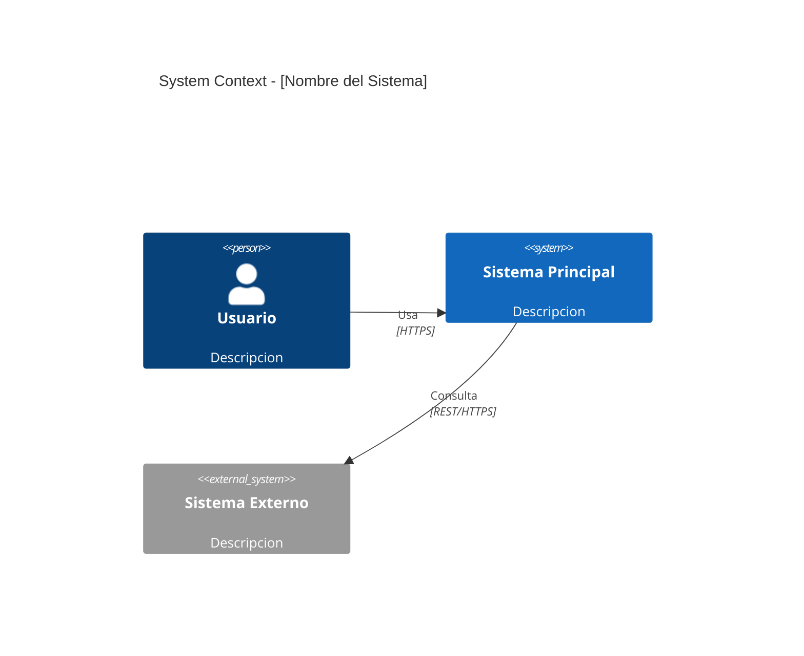
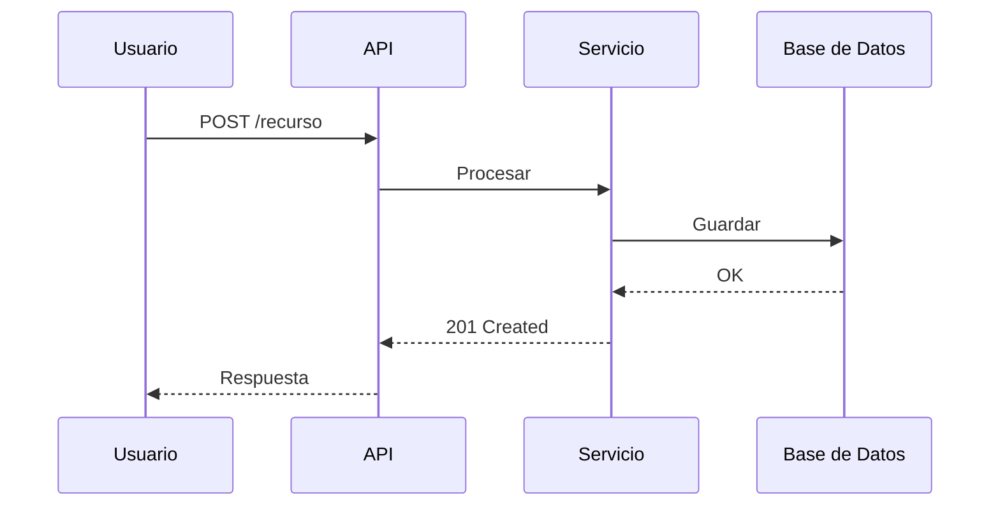

# Skill: Generacion de Diagramas de Arquitectura
# Version: 2026.3
# Tipo: Skill de soporte (invocado por otros skills)

> Referencia: Brown, S. *C4 Model.* c4model.com
> Referencia: ISO/IEC/IEEE 42010:2022 — Architecture Views
> Tooling: yctimlin/mcp_excalidraw — Canvas server + MCP con 26 herramientas
> Tooling: diagrams.mingrammer.com — Diagram as Code con iconos cloud (AWS/GCP/Azure/K8s)
> Hub: `drawflow/SKILL.md` — Hub unificado de herramientas de diagramación

---

## Proposito

Generar diagramas de arquitectura usando el modelo C4 como notacion principal.
Usa el MCP server de Excalidraw (yctimlin/mcp_excalidraw) para creacion iterativa
element-by-element. NUNCA generar JSON raw de Excalidraw — siempre usar las herramientas
del server (MCP tools o REST API).

Este skill se activa cuando:
- Un artefacto necesita diagramas (ver estrategia abajo)
- El usuario pide generar o actualizar un diagrama de arquitectura
- Se necesita un diagrama C4 (Context, Container, Component, Deployment)
- Se necesita un diagrama de secuencia, flujo o Context Map

---

## Roles colaboradores en este artefacto

> El skill de diagramas es transversal — se invoca desde Tech Spec, System Design,
> RFC, etc. El rol consultado depende del diagrama. Ver diagrama de roles en `README.md`.

| Rol | Que pedirle al consultarlo | En que diagrama |
|---|---|---|
| **Especialista Tecnico** (SWA / Tech Lead) | Validar que los containers del C4 L2 son los que el equipo va a construir; nombres y limites de cada container | C4 Container (Tech Spec) |
| **DevOps / SRE** | Validar topologia de deployment; AZs, VPCs, networking | C4 Deployment (System Design) |
| **Acelerador / Sponsor** | Audiencia principal del C4 L1 (System Context) — debe entenderlo sin contexto tecnico | C4 Context (RFC) |
| **Compliance / Legal** | Solo en diagramas que muestran flujos de datos sensibles o cross-border | Flujo de datos (System Design) |

> El SA es quien dibuja, pero NO debe declarar el diagrama "definitivo" sin
> validacion del rol indicado segun el tipo de diagrama.

---

## IMPORTANTE: Nunca Generar JSON Raw

El MCP de Excalidraw tiene un canvas server con 26 herramientas que crean, modifican y
exportan diagramas element-by-element. Generar JSON raw completo de Excalidraw desperdicia
tokens masivamente y no permite iteracion.

**SIEMPRE usar:** MCP tools (batch_create_elements, update_element, etc.) o REST API
**NUNCA usar:** mcp__claude_ai_Excalidraw__create_view con JSON gigante

---

## Setup del Canvas Server

El MCP server de Excalidraw vive en: `/Users/didierrestrepo/MK/arquitectureflow-main/drawflow/tools/excalidraw-local/server/`

### Librerias disponibles (en `drawflow/tools/excalidraw-local/libs/`)
- `c4-architecture.excalidrawlib` — Person, Web App, Mobile App, Component, System, Existing System, Database, Group, Relation
- `hexagonal-architecture.excalidrawlib` — Shapes de arquitectura hexagonal
- `bpmn.excalidrawlib` — Notacion BPMN para procesos de negocio
- `library.excalidrawlib` — Shapes generales de arquitectura

### Iniciar el canvas server
```bash
cd /Users/didierrestrepo/MK/arquitectureflow-main/drawflow/tools/excalidraw-local/server
PORT=3000 npm run canvas
# Abrir http://localhost:3000 en navegador para ver el canvas en vivo
```

### Registrar MCP server en Claude Code (una vez)
```bash
claude mcp add excalidraw -s user \
  -e EXPRESS_SERVER_URL=http://localhost:3000 \
  -- node /Users/didierrestrepo/MK/arquitectureflow-main/drawflow/tools/excalidraw-local/server/dist/index.js
```

### Verificar que el server esta corriendo
```bash
curl -s http://localhost:3000/health
```

---

## Estrategia: Excalidraw vs Mermaid

### Usar Excalidraw MCP cuando:
- Diagramas C4 Level 1 (System Context) — necesitan visual argument
- Diagramas C4 Level 2 (Container) — layout espacial importa
- Diagramas de deployment — topologia de infraestructura
- Context Maps (DDD) — relaciones complejas entre bounded contexts
- Stakeholder maps — relaciones multiples
- El arquitecto va a iterar y refinar el diagrama interactivamente

### Usar Mermaid cuando:
- Diagramas de secuencia — Mermaid es superior para secuencias
- Diagramas de flujo simples
- Diagramas C4 texto-based (Git-diffable)
- Diagramas de estado/maquina de estados

### Usar Diagrams Python (`diagrams-python`) cuando:
- Arquitectura de infraestructura AWS/GCP/Azure/K8s — **iconos oficiales**
- Diagram as Code (versionable en Git como Python)
- Clusters con agrupación visual de servicios
- Topologías de red con servicios cloud específicos
- Se necesita output PNG/SVG de alta calidad sin canvas interactivo

> **Hub completo:** Ver `drawflow/SKILL.md` para la tabla de decisión completa
> y documentación de las 3 herramientas.

---

## Mapa Artefacto -> Diagramas

| Artefacto | Diagrama | Formato | C4 Nivel | Obligatorio |
|---|---|---|---|---|
| RFC | Context del problema | Excalidraw | L1 | SHOULD |
| PRD | Stakeholder map | Excalidraw | -- | SHOULD |
| PRD | Flujos de caso de uso | Mermaid sequence | -- | Condicional |
| Tech Spec | Container diagram | Excalidraw | L2 | MUST |
| Tech Spec | Secuencias de integracion | Mermaid sequence | -- | SHOULD |
| System Design | Container + deployment | Excalidraw | L2 + deploy | MUST |
| System Design | Flujo de datos | Mermaid flowchart | -- | SHOULD |
| System Design | Context Map (DDD) | Excalidraw | -- | Condicional |
| Runbook | Flujo operacional | Mermaid flowchart | -- | SHOULD |
| Post-Mortem | Timeline | Mermaid timeline | -- | SHOULD |

---

## Protocolo Excalidraw MCP Server

### Modo MCP (preferido) — 26 herramientas

Si las tools `excalidraw/*` estan disponibles (batch_create_elements, etc.):

```
1. read_diagram_guide          → Mejores practicas de diseno
2. clear_canvas                → Lienzo limpio
3. batch_create_elements       → Crear shapes + text + arrows en un batch
   - Shapes: usar "text" field para labels (auto-convierte)
   - Arrows: usar startElementId/endElementId para binding automatico
4. set_viewport(scrollToContent: true) → Auto-fit
5. get_canvas_screenshot       → Verificar visualmente (Quality Checklist)
6. update_element              → Ajustar basado en feedback
7. snapshot_scene("v1")        → Guardar version
8. export_to_excalidraw_url    → Compartir URL
9. export_scene(filePath)      → Guardar .excalidraw en proyecto
```

### Modo REST API (fallback) — cuando MCP tools no estan registradas

Si las MCP tools no estan disponibles pero el canvas server corre en localhost:3000:

```
1. DELETE /api/elements/clear              → Lienzo limpio
2. POST /api/elements/batch               → Crear elementos en batch
   - Labels: usar "label": {"text": "..."} (diferente de MCP!)
   - Arrows: usar "start": {"id": "..."} / "end": {"id": "..."} (diferente de MCP!)
3. POST /api/snapshots {name: "v1"}       → Guardar snapshot
4. GET /api/elements                       → Obtener todos los elementos
5. PUT /api/elements/:id                   → Actualizar elemento individual
6. POST /api/export/image                  → Exportar PNG (necesita browser abierto)
```

### Formato MCP vs REST (CRITICO)

| Campo | MCP | REST API |
|---|---|---|
| Labels en shapes | `"text": "Mi Label"` | `"label": {"text": "Mi Label"}` |
| Arrow binding | `startElementId` / `endElementId` | `"start": {"id": "..."}` / `"end": {"id": "..."}` |
| fontFamily | String `"1"` o omitir | String `"1"` o omitir |

---

## Convenciones C4 para Excalidraw

### Paleta C4 (colores profesionales verificados)

| Elemento C4 | Background | Stroke | Text nombre | Text tech | Text desc |
|---|---|---|---|---|---|
| Persona (head+body) | `#08427b` | `#08427b` | `#1e3a5f` (exterior) | — | — |
| Container interno | `#438dd5` | `#2e6295` | `#ffffff` 18px | `#a5d8ff` 12px | `#dbe4ff` 11px |
| Container DB/Queue | `#438dd5` | `#2e6295` | `#ffffff` 18px | `#a5d8ff` 12px | `#dbe4ff` 11px |
| Sistema externo | `#999999` | `#6b6b6b` | `#ffffff` 18px | `#dee2e6` 12px | `#dee2e6` 11px |
| Component (L3) | `#85BBF0` | `#5a9bd5` | `#1e3a5f` 16px | `#2e6295` 11px | `#495057` 10px |
| Cross-cutting (L3) | `#FFD43B` | `#e8a317` | `#1e3a5f` 16px | `#6b5b00` 11px | `#495057` 10px |
| Boundary | `#e8f4f8` opacity 40 | `#1168bd` dashed | `#1168bd` 14px | — | — |
| Titulo del diagrama | — | — | `#1e3a5f` 28px | — | — |
| Arrow interna | — | `#495057` width 2 | — | — | — |
| Arrow a externo | — | `#868e96` dashed | — | — | — |
| Legend | — | — | `#868e96` 13px | — | — |

> Usar `fontFamily: 2` (Helvetica/sans-serif) y `roughness: 0` en todos los elementos.

### Estructura de un Container C4

Cada container = **4 elementos** en un solo batch:

1. **Rectangle** (fondo): `backgroundColor="#438dd5"`, `width=250`, `height=120`, `roughness=0`
2. **Text nombre** (grande): `fontSize=18`, `strokeColor="#ffffff"`, posicionado dentro del rect
3. **Text tech** (medio): `fontSize=12`, `strokeColor="#a5d8ff"`, entre corchetes `[Node.js]`
4. **Text desc** (pequeno): `fontSize=11`, `strokeColor="#dbe4ff"`, descripcion corta

**Persona** = ellipse (cabeza 50x50) + rectangle (cuerpo 100x60) + texto exterior.
**Arrow** = `type: "arrow"` con `startElementId`/`endElementId` apuntando a los IDs de los shapes.

### Layout: Coordenadas recomendadas

```
Y=0-40:     Titulo del diagrama
Y=70-200:   Personas (arriba)
Y=250-280:  Labels de protocolo de personas
Y=310-500:  Boundary + Containers fila 1 (SPA, API, Mobile)
Y=540-670:  Containers fila 2 (servicios backend)
Y=710-820:  Containers fila 3 (DB, queue)
Y=850-870:  Legend

X=50-300:   Columna izquierda
X=330-610:  Columna centro
X=630-900:  Columna derecha
X=950-1200: Sistemas externos (fuera del boundary)
```

> **Regla de oro:** Crear TODO en UN solo `batch_create_elements` — shapes, textos y arrows juntos.
> Asignar `id` a cada shape para que los arrows usen `startElementId`/`endElementId`.

### Ejemplo: Patron Minimo C4 Container (copiar y adaptar)

```json
batch_create_elements([
  // --- TITULO ---
  {"type":"text","x":200,"y":10,"text":"C4 Container - Mi Sistema",
   "fontSize":28,"fontFamily":2,"strokeColor":"#1e3a5f","id":"title"},

  // --- PERSONA ---
  {"type":"ellipse","x":460,"y":70,"width":50,"height":50,
   "backgroundColor":"#08427b","strokeColor":"#08427b","roughness":0,"id":"user-head"},
  {"type":"rectangle","x":435,"y":125,"width":100,"height":60,
   "backgroundColor":"#08427b","strokeColor":"#08427b","roughness":0,"id":"user-body"},
  {"type":"text","x":440,"y":195,"text":"Usuario\n[Persona]",
   "fontSize":14,"fontFamily":2,"strokeColor":"#1e3a5f"},

  // --- BOUNDARY ---
  {"type":"rectangle","x":50,"y":290,"width":860,"height":250,
   "backgroundColor":"#e8f4f8","strokeColor":"#1168bd","strokeStyle":"dashed",
   "opacity":40,"roughness":0,"id":"boundary"},
  {"type":"text","x":65,"y":300,"text":"Mi Sistema [Software System]",
   "fontSize":14,"fontFamily":2,"strokeColor":"#1168bd"},

  // --- CONTAINER: API (patron de 4 elementos) ---
  {"type":"rectangle","x":355,"y":340,"width":250,"height":120,
   "backgroundColor":"#438dd5","strokeColor":"#2e6295","roughness":0,"id":"api"},
  {"type":"text","x":410,"y":355,"text":"API Backend","fontSize":18,
   "fontFamily":2,"strokeColor":"#ffffff"},
  {"type":"text","x":410,"y":380,"text":"[Node.js]","fontSize":12,
   "fontFamily":2,"strokeColor":"#a5d8ff"},
  {"type":"text","x":380,"y":400,"text":"Logica de negocio","fontSize":11,
   "fontFamily":2,"strokeColor":"#dbe4ff"},

  // --- SISTEMA EXTERNO ---
  {"type":"rectangle","x":700,"y":340,"width":200,"height":100,
   "backgroundColor":"#999999","strokeColor":"#6b6b6b","roughness":0,"id":"ext"},
  {"type":"text","x":730,"y":355,"text":"Stripe","fontSize":18,
   "fontFamily":2,"strokeColor":"#ffffff"},
  {"type":"text","x":720,"y":380,"text":"[External System]","fontSize":12,
   "fontFamily":2,"strokeColor":"#dee2e6"},

  // --- ARROWS (usan IDs de los shapes) ---
  {"type":"arrow","x":485,"y":185,"startElementId":"user-body",
   "endElementId":"api","strokeColor":"#495057","strokeWidth":2},
  {"type":"arrow","x":605,"y":400,"startElementId":"api",
   "endElementId":"ext","strokeColor":"#868e96","strokeStyle":"dashed","strokeWidth":1},

  // --- LABELS + LEGEND ---
  {"type":"text","x":450,"y":270,"text":"Calls [JSON/HTTPS]","fontSize":11,
   "fontFamily":2,"strokeColor":"#495057"},
  {"type":"text","x":50,"y":490,
   "text":"Legend: azul=Container interno  gris=Sistema externo  persona=Usuario",
   "fontSize":13,"fontFamily":2,"strokeColor":"#868e96"}
])
```

> **Despues del batch:** llamar `set_viewport({scrollToContent: true})` y luego
> `get_canvas_screenshot()` para verificar visualmente. Si algo se ve mal, usar
> `update_element` para ajustar posiciones.

### Anti-patrones a evitar

1. NO generar JSON raw de Excalidraw — usar `batch_create_elements`
2. NO poner labels dentro del boundary rectangle (se centran y tapan) — texto libre en esquina
3. NO usar fontSize < 11 — ilegible en export
4. NO cruzar flechas por zonas no relacionadas
5. NO crear arrows ANTES de los shapes — los IDs no existen aun
6. NO crear batches separados para shapes y arrows — hacer todo en UN batch
7. NO olvidar `roughness: 0` — sin el, los bordes salen irregulares (hand-drawn)

---

## Workflow Completo de Generacion C4

### Paso 1: Verificar canvas server
```bash
curl -s http://localhost:3000/health
```
Si no responde, iniciar: `cd drawflow/tools/excalidraw-local/server && PORT=3000 npm run canvas`

### Paso 2: Limpiar canvas
`clear_canvas`

### Paso 3: Crear TODOS los elementos en UN solo batch
Un solo `batch_create_elements` con shapes + textos + arrows.
Usar el ejemplo de arriba como patron. Asignar `id` a cada shape para que los arrows
los referencien con `startElementId`/`endElementId`.

### Paso 4: Verificar visualmente
```
set_viewport({ scrollToContent: true })
get_canvas_screenshot()
```
Revisar: Se ven todos los labels? Las arrows conectan bien? El layout es limpio?

### Paso 5: Iterar
Usar `update_element` para ajustar posiciones, tamanos o colores segun feedback del usuario.

### Paso 6: Guardar
- `snapshot_scene("c4-container-v1")` — guardar version
- `export_scene({ filePath: "ruta/diagrama.excalidraw" })` — archivo .excalidraw
- `export_to_image({ format: "png" })` — imagen PNG (necesita browser abierto)

---

## Templates Mermaid (alternativa text-based)

### C4 Context (L1) en Mermaid


### Diagrama de Secuencia

