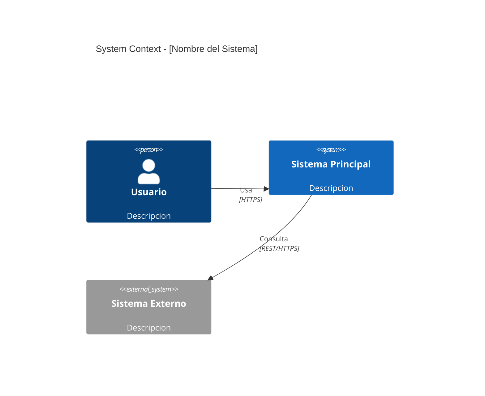
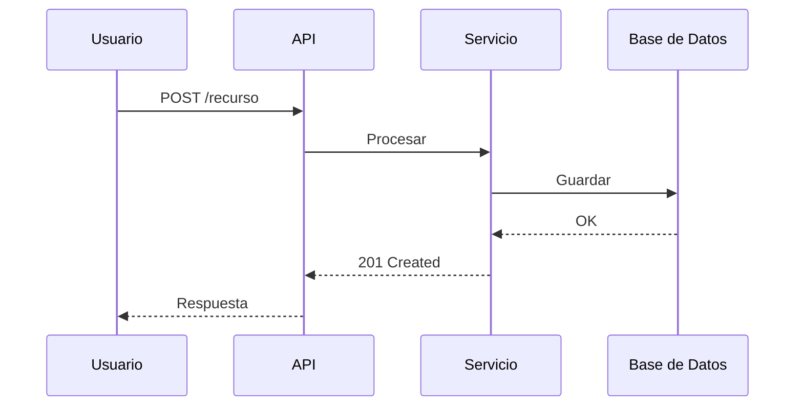

# Skill: Generacion de Diagramas de Arquitectura
# Version: 2026.3
# Tipo: Skill de soporte (invocado por otros skills)

> Referencia: Brown, S. *C4 Model.* c4model.com
> Referencia: ISO/IEC/IEEE 42010:2022 — Architecture Views
> Tooling: yctimlin/mcp_excalidraw — Canvas server + MCP con 26 herramientas

---

## Proposito

Generar diagramas de arquitectura usando el modelo C4 como notacion principal.
Usa el MCP server de Excalidraw (yctimlin/mcp_excalidraw) para creacion iterativa
element-by-element. NUNCA generar JSON raw de Excalidraw — siempre usar las herramientas
del server (MCP tools o REST API).

Este skill se activa cuando:
- Un artefacto necesita diagramas (ver estrategia abajo)
- El usuario pide generar o actualizar un diagrama de arquitectura
- Se necesita un diagrama C4 (Context, Container, Component, Deployment)
- Se necesita un diagrama de secuencia, flujo o Context Map

---

## IMPORTANTE: Nunca Generar JSON Raw

El MCP de Excalidraw tiene un canvas server con 26 herramientas que crean, modifican y
exportan diagramas element-by-element. Generar JSON raw completo de Excalidraw desperdicia
tokens masivamente y no permite iteracion.

**SIEMPRE usar:** MCP tools (batch_create_elements, update_element, etc.) o REST API
**NUNCA usar:** mcp__claude_ai_Excalidraw__create_view con JSON gigante

---

## Setup del Canvas Server

El MCP server de Excalidraw vive en: `/Users/themakers/mcp_excalidraw/`

### Librerias disponibles (en `mcp_excalidraw/ext/`)
- `c4-architecture.excalidrawlib` — Person, Web App, Mobile App, Component, System, Existing System, Database, Group, Relation
- `hexagonal-architecture.excalidrawlib` — Shapes de arquitectura hexagonal
- `bpmn.excalidrawlib` — Notacion BPMN para procesos de negocio
- `library.excalidrawlib` — Shapes generales de arquitectura

### Iniciar el canvas server
```bash
cd /Users/themakers/mcp_excalidraw
PORT=3000 npm run canvas
# Abrir http://localhost:3000 en navegador para ver el canvas en vivo
```

### Registrar MCP server en Claude Code (una vez)
```bash
claude mcp add excalidraw -s user \
  -e EXPRESS_SERVER_URL=http://localhost:3000 \
  -- node /Users/themakers/mcp_excalidraw/dist/index.js
```

### Verificar que el server esta corriendo
```bash
curl -s http://localhost:3000/health
```

---

## Estrategia: Excalidraw vs Mermaid

### Usar Excalidraw MCP cuando:
- Diagramas C4 Level 1 (System Context) — necesitan visual argument
- Diagramas C4 Level 2 (Container) — layout espacial importa
- Diagramas de deployment — topologia de infraestructura
- Context Maps (DDD) — relaciones complejas entre bounded contexts
- Stakeholder maps — relaciones multiples
- El arquitecto va a iterar y refinar el diagrama interactivamente

### Usar Mermaid cuando:
- Diagramas de secuencia — Mermaid es superior para secuencias
- Diagramas de flujo simples
- Diagramas C4 texto-based (Git-diffable)
- Diagramas de estado/maquina de estados

---

## Mapa Artefacto -> Diagramas

| Artefacto | Diagrama | Formato | C4 Nivel | Obligatorio |
|---|---|---|---|---|
| RFC | Context del problema | Excalidraw | L1 | SHOULD |
| PRD | Stakeholder map | Excalidraw | -- | SHOULD |
| PRD | Flujos de caso de uso | Mermaid sequence | -- | Condicional |
| Tech Spec | Container diagram | Excalidraw | L2 | MUST |
| Tech Spec | Secuencias de integracion | Mermaid sequence | -- | SHOULD |
| System Design | Container + deployment | Excalidraw | L2 + deploy | MUST |
| System Design | Flujo de datos | Mermaid flowchart | -- | SHOULD |
| System Design | Context Map (DDD) | Excalidraw | -- | Condicional |
| Runbook | Flujo operacional | Mermaid flowchart | -- | SHOULD |
| Post-Mortem | Timeline | Mermaid timeline | -- | SHOULD |

---

## Protocolo Excalidraw MCP Server

### Modo MCP (preferido) — 26 herramientas

Si las tools `excalidraw/*` estan disponibles (batch_create_elements, etc.):

```
1. read_diagram_guide          → Mejores practicas de diseno
2. clear_canvas                → Lienzo limpio
3. batch_create_elements       → Crear shapes + text + arrows en un batch
   - Shapes: usar "text" field para labels (auto-convierte)
   - Arrows: usar startElementId/endElementId para binding automatico
4. set_viewport(scrollToContent: true) → Auto-fit
5. get_canvas_screenshot       → Verificar visualmente (Quality Checklist)
6. update_element              → Ajustar basado en feedback
7. snapshot_scene("v1")        → Guardar version
8. export_to_excalidraw_url    → Compartir URL
9. export_scene(filePath)      → Guardar .excalidraw en proyecto
```

### Modo REST API (fallback) — cuando MCP tools no estan registradas

Si las MCP tools no estan disponibles pero el canvas server corre en localhost:3000:

```
1. DELETE /api/elements/clear              → Lienzo limpio
2. POST /api/elements/batch               → Crear elementos en batch
   - Labels: usar "label": {"text": "..."} (diferente de MCP!)
   - Arrows: usar "start": {"id": "..."} / "end": {"id": "..."} (diferente de MCP!)
3. POST /api/snapshots {name: "v1"}       → Guardar snapshot
4. GET /api/elements                       → Obtener todos los elementos
5. PUT /api/elements/:id                   → Actualizar elemento individual
6. POST /api/export/image                  → Exportar PNG (necesita browser abierto)
```

### Formato MCP vs REST (CRITICO)

| Campo | MCP | REST API |
|---|---|---|
| Labels en shapes | `"text": "Mi Label"` | `"label": {"text": "Mi Label"}` |
| Arrow binding | `startElementId` / `endElementId` | `"start": {"id": "..."}` / `"end": {"id": "..."}` |
| fontFamily | String `"1"` o omitir | String `"1"` o omitir |

---

## Convenciones C4 para Excalidraw

### Colores C4 (de la libreria c4-architecture.excalidrawlib)

| Elemento C4 | Background | Stroke | Texto |
|---|---|---|---|
| Persona | `#0c37a2` | `#0c37a2` | `#ffffff` |
| Sistema/Contenedor | `#228be6` | `#2a5da7` | `#ffffff` |
| Sistema externo | `#868e96` | `#495057` | `#ffffff` |
| Queue/Especial | `#7048e8` | `#5f3dc4` | `#ffffff` |
| Boundary/grupo | `#ced4da` opacity 15 | `#868e96` dashed | `#868e96` |
| Texto tecnologia | -- | -- | `#a5d8ff` o `#dee2e6` |
| Texto descripcion | -- | -- | `#dbe4ff` o `#dee2e6` |

### Estructura de elementos C4

Cada contenedor se construye con:
1. **Rectangle** (fondo): `roundness: {type: 3}`, backgroundColor del color C4
2. **Text nombre** (grande): fontSize 20, color blanco
3. **Text tecnologia** (medio): fontSize 14, entre corchetes `[.NET 8]`, color claro
4. **Text descripcion** (pequeno): fontSize 14, descripcion corta, color claro

**Persona** se construye con:
1. **Ellipse** (cabeza): backgroundColor persona
2. **Rectangle** (cuerpo): roundness, backgroundColor persona
3. **Text nombre**: fontSize 16, blanco
4. **Text tipo**: fontSize 14, `[Persona Natural]`

**Relaciones** (arrows):
- Usar binding por ID (startElementId/start.id -> endElementId/end.id)
- Label corto: verbo + protocolo en maximo 15 chars. Ej: "Calls [REST]"
- Relaciones a externos: strokeColor gris (`#868e96`)
- Relaciones internas: strokeColor oscuro (`#495057`)

### Anti-patrones a evitar

1. NO poner labels en rectangulos de boundary (se centran y tapan todo)
   → Usar texto libre posicionado en la esquina superior del boundary
2. NO cruzar flechas por zonas no relacionadas
3. NO poner labels en todas las flechas — solo cuando el protocolo importa
4. NO usar fontSize < 14 — ilegible

---

## Workflow Completo de Generacion C4

### Paso 1: Verificar canvas server
```bash
curl -s http://localhost:3000/health
```
Si no responde, iniciar: `cd /Users/themakers/mcp_excalidraw && PORT=3000 npm run canvas`

### Paso 2: Limpiar canvas
MCP: `clear_canvas` / REST: `DELETE /api/elements/clear`

### Paso 3: Crear elementos por capas
1. **Titulo y persona** (batch 1)
2. **Boundary y containers internos** (batch 2)
3. **Sistemas externos** (batch 3)
4. **Arrows/relaciones** (batch 4) — SIEMPRE despues de crear los shapes

### Paso 4: Verificar
MCP: `get_canvas_screenshot` → Quality Checklist
REST: Abrir http://localhost:3000 en navegador

### Paso 5: Iterar
Ajustar posiciones, tamanos, labels con update_element o PUT /api/elements/:id

### Paso 6: Guardar
- Snapshot: `POST /api/snapshots {name: "nombre-v1"}`
- Exportar .excalidraw: `GET /api/elements` → guardar como JSON en proyecto
- Exportar imagen: `POST /api/export/image` (necesita browser)

---

## Templates Mermaid

### C4 Context (L1) en Mermaid


### Diagrama de Secuencia

